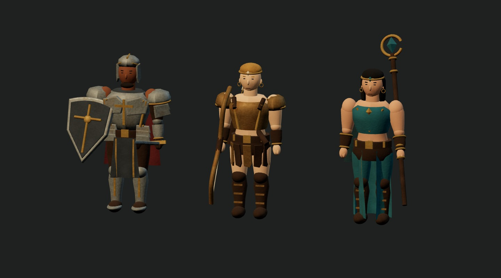
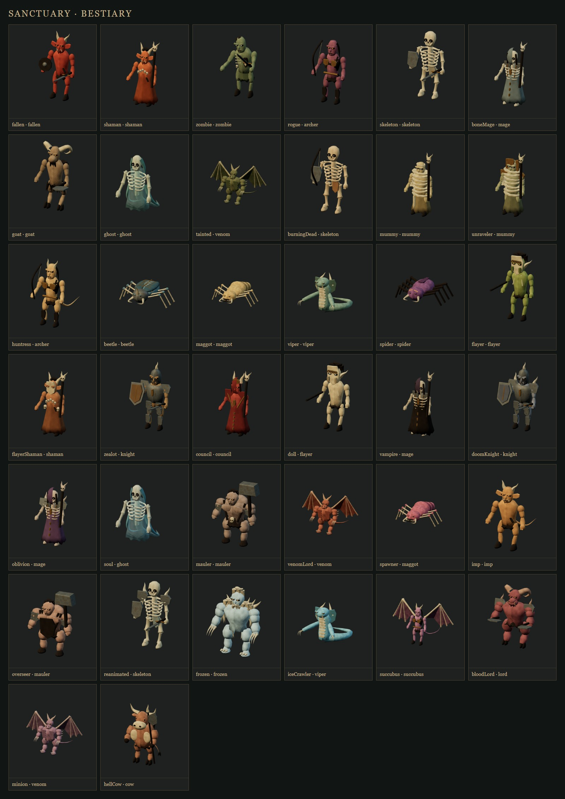
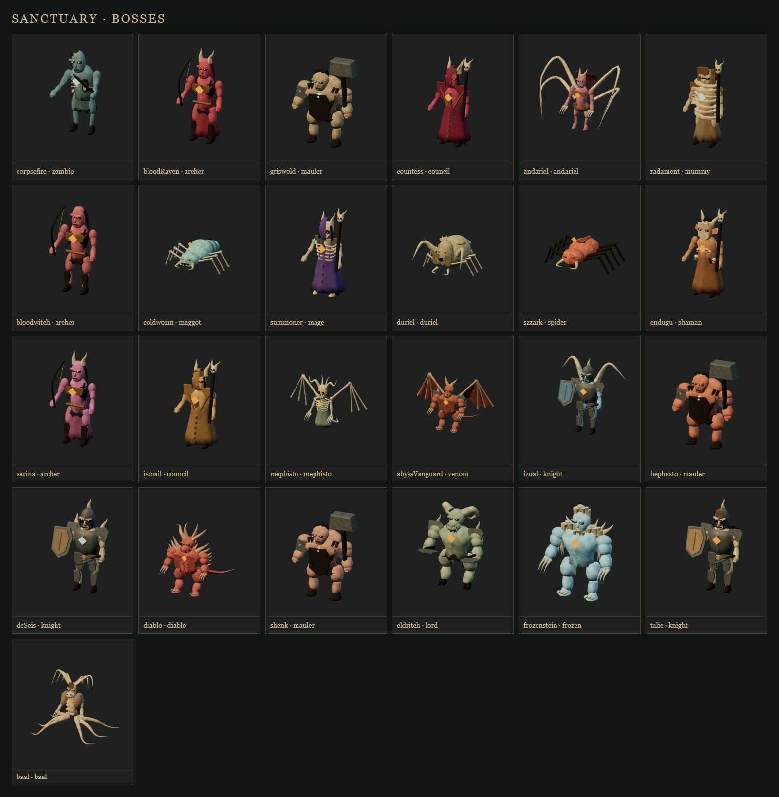

# 角色与全怪物建模

本次覆盖三个职业、38 种普通怪物和 25 个首领，共 28 种怪物基础体型。模型参考《暗黑破坏神 II》的职业装备、怪物解剖和姿态，以当前 Three.js 等距视角重新制作；仍为原创程序网格，没有导入原版模型或贴图，细节精度与《狱火重生》的美术资源仍有差距。

圣骑士采用开放式圆顶盔、分片胸甲、叠层肩甲、护腿和金属包边战袍；亚马逊保留青铜甲、皮革甲片、金发马尾、护臂和箭袋；法师使用黑发、额饰、青绿长裙和分片金边。面部比例、眼眉、武器刃面和布料摆动同步调整。装备节点仍对应当前武器类型，弓、盾、法杖与投掷武器可分别切换。

| 基础体型 | 主要建模特征 |
| --- | --- |
| 沉沦魔 fallen | 低伏姿势、尖耳、弯角、獠牙、皮裙、短刃与圆盾 |
| 巫师 shaman | 骨饰、骷髅法杖、破损袍边；剥皮巫师增加面具与腰间颅骨 |
| 僵尸 zombie | 前探头部、不对称肩臂、外露肋骨、破布与拖行姿势 |
| 骷髅 skeleton | 颅骨眼窝、牙列、脊柱、弧形肋骨、骨盆、细长四肢 |
| 弓手 archer | 收腰躯干、长发、皮甲、护胫、箭袋；女猎人增加兽耳和尾巴 |
| 法师 mage | 骷髅头、开放肋骨、兜帽、肩饰与骷髅杖；吸血鬼增加长袍和獠牙 |
| 羊头人 goat | 盘角、长吻、山羊胡、毛皮腿、反关节和分瓣蹄 |
| 幽灵 ghost | 半透明破袍、悬浮骨架、下垂长臂与飘散尾迹 |
| 木乃伊 mummy | 头身和手臂绷带、破损下摆；复活型增加仪式头冠与肩饰 |
| 甲虫 beetle | 双瓣鞘翅、中央甲缝、翅壳纹路、头角和关节足 |
| 沙虫 maggot | 多节腹部、环状褶皱、口器獠牙和爬行肢体 |
| 蝮蛇 viper | 盘尾、蛇颈、颈侧鳞片、腹部盾鳞与利爪 |
| 蜘蛛 spider | 八足关节、复眼、毒牙、腹部花纹与细毛 |
| 剥皮者 flayer | 骨木面具、冠饰、皮裙、骨饰和吹管 |
| 议会 council | 肩披、法袍、金属饰带与仪式头冠 |
| 骑士 knight | 封闭战盔、眼缝、分层板甲、护胫和纹章盾 |
| 巨兽 mauler | 驼背厚肩、宽胸、皮围裙、颅骨腰饰与包铁战锤 |
| 翼魔 venom | 甲状胸腹、爪、肘刺、分指翼骨、凹边翼膜与尾巴 |
| 小妖 imp | 短身宽躯干、尖耳、细尾、獠牙与低伏姿势 |
| 女妖 succubus | 收腰皮甲、额角、长发、翼膜、爪与弯尾 |
| 冰兽 frozen | 头颈鬃毛、肩背骨刺、前臂长毛与宽掌 |
| 死亡之王 lord | 盘角长吻、毛皮腿、分瓣蹄、带刺肩甲与双斧 |
| 奶牛 cow | 直立牛头人、牛角、分瓣蹄、垂尾和长柄钺 |
| 安达利尔 andariel | 细长躯干、赤褐长发、四条背部附肢、金属装饰与利爪 |
| 都瑞尔 duriel | 厚重虫腹、分节甲壳、头角、獠牙、镰状前肢与六足 |
| 墨菲斯托 mephisto | 浮空脊骨、肋架、冠状弯角、伸展翼骨和长爪 |
| 迪亚波罗 diablo | 深红皮肤、双层弯角、分区胸腹、背刺、反关节腿与长尾 |
| 巴尔 baal | 高冠、下颌须、肩甲、胸前骨片和六条下身触肢 |

同族变体保留定义中的配色。血鸟、女伯爵、召唤者等增加仪式头饰；格里斯瓦德、海法斯特、督军和奴役者使用围裙与臂甲；厄运骑士、遗忘骑士、西希之王和复生战士增加带刺护甲；衣卒尔增加背部骨翼，塔力克增加毛皮领饰。

`src/actor-modeling.ts` 提供截面网格、带倒角的甲片、材质和刚性网格合并。骨骼、皮肤、兽皮、布、皮革、钢铁和青铜分别使用物体坐标中的程序纹理、粗糙度和表面凹凸，无需新增图片纹理。每个角色独立持有材质，受击和召唤物染色不会污染其他对象。静态零件只在同一关节内按材质合并，手部武器随肘关节移动，膝、翅膀、尾巴和头部保留动画。

新增 `npm run test:models` 遍历全部 63 个怪物定义，检查正背面、攻击与移动、手机取景、着色器错误、绘制预算和三轮全图鉴切换后的资源释放，并生成模型总览。输出目录可通过 `OUTPUT_DIR` 指定，浏览器地址可通过 `BASE_URL` 指定。单元测试检查截面朝向、28 种体型的动作复位、模型资源独立性与持握节点。战斗平衡测试使用仅包含变换节点的 Actor，防止美术网格创建时的随机 UUID 改变战斗随机序列；真实模型由视觉测试覆盖。

验证通过：313 项单元测试、生产构建、全模型与角色特效、三职业、远程武器、图鉴、25 个地图和场景回归。单怪展示最多 45 次绘制、18,388 个三角形；三轮遍历全部怪物并销毁后，专用测试渲染器的几何体与纹理计数均回到 0。随机地图下的远程测试现沿可见路径接近屏外怪物，手机宝箱测试先进入交互距离再点击标签。生产构建仍有既有的大体积 JavaScript 分包提示。

参考：[暴雪圣骑士资料](https://classic.battle.net/diablo2exp/classes/paladin.shtml)、[暴雪沉沦魔资料与怪物索引](https://classic.battle.net/diablo2exp/monsters/act1-fallen.shtml)。
