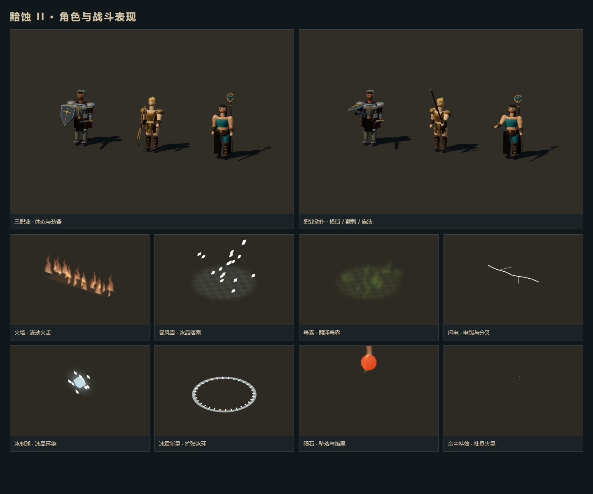

# 角色、动作与技能表现

角色与全部怪物的最新建模、体型覆盖和预览见 [角色与全怪物建模](actor-models.md)。

三职业采用独立的原创几何模型，以《暗黑破坏神 2》的职业轮廓、材质和魔法语言为参考。模型在等距视角下优先保留可辨认的装备和姿态，同时降低头部比例、收敛金属高光，增加面部轮廓、服装分层、关节和布料摆动。

| 职业 | 模型特征 |
| --- | --- |
| 圣骑士 | 深肤色面部、开放式头盔、分层板甲、深蓝战袍、暗红披风与金属包边盾牌 |
| 亚马逊 | 金色马尾、青铜胸甲、皮革裙甲、护臂、长靴与背部箭袋；弓由左手持握 |
| 法师 | 黑发与额饰、青绿分片长裙、金饰、手杖与施法手势 |

剑、斧、钉锤和长矛有不同的持握模型，弓、弩、标枪和投掷武器有独立显示节点。武器切换依据实际装备类别更新轮廓，飞刀和飞斧飞行时旋转，长矛普攻采用戳刺动作。女武神与诱饵使用独立拥有资源的亚马逊模型，诱饵的半透明色调不会污染玩家模型。

动作包含呼吸待机、行走、跑步、挥砍、戳刺、拉弓、投掷、施法、盾击和受击恢复。肩、肘、髋、膝分别驱动，披风与裙片随行动摆动。动作在实际技能开始、连击和受击恢复时触发；表现不改写角色世界坐标、伤害、耗蓝或技能冷却。怪物按体型区分僵尸拖行、重型步态、虫类足部运动、弓手瞄准和法师蓄力，并增加释放动作及短暂受击亮色。

| 特效 | 表现 |
| --- | --- |
| 火焰 | 火弹与火球具有亮芯和焰尾；火墙、地狱之火和燃烧地面使用流动火舌，陨石先下落再产生撞击火星 |
| 冰霜 | 冰弹采用棱面冰晶；冰封球带旋转碎晶，冰霜新星扩张，暴风雪在作用区内降下冰片 |
| 闪电 | 闪电和连锁电击使用折线电弧、细亮芯与支叉；投射物的装饰随飞行方向更新 |
| 毒素 | 毒弹保留绿色轨迹，地面毒区呈低亮度翻涌雾团 |
| 圣光与增益 | 圣光弹和祝福之锤采用暖金色；灵气增加符文，冰甲与能量护盾各自显示并随增益结束消退 |
| 命中与交互 | 命中、治疗、传送和任务触发使用有寿命的批量火星；远程弹道、地面作用区和敌方预警仍对应实际战斗对象 |

`src/hero-models.ts` 负责角色外观与动作，`src/visual-effects.ts` 负责特效创建、更新和释放。静态零件按关节和材质合并；一次命中最多 48 个点粒子，持续地面特效最多 32 个实例，创建命中效果时把临时效果队列约束在 80 个以内。角色之间不共享可被染色的材质；销毁同时处理 Mesh、Points、线段与实例缓冲，避免切换角色或地图累积资源。

验证包括 `npm test`（294 项）、`npm run build`、`npm run test:visuals`、三职业与远程武器浏览器回归、25 个关卡场景和地图交互检查，以及长时间内存回归。视觉脚本检查动作差异、八类特效与旋转投掷武器的实际着色器渲染、手机画面、绘制数量和重复创建/销毁后的资源稳定性。测试截图由运行中的 Three.js 场景生成。

职业参考：[圣骑士](https://classic.battle.net/diablo2exp/classes/paladin.shtml)、[亚马逊](https://classic.battle.net/diablo2exp/classes/amazon.shtml)、[法师](https://classic.battle.net/diablo2exp/classes/sorceress.shtml)；火焰技能参考：[暴雪火焰技能说明](https://classic.battle.net/diablo2exp/skills/sorceress-fire.shtml)。本项目使用原创网格、程序动作和着色器，并未导入原版模型、贴图或逐帧动画；服装也尚未逐件对应全部装备底材。
