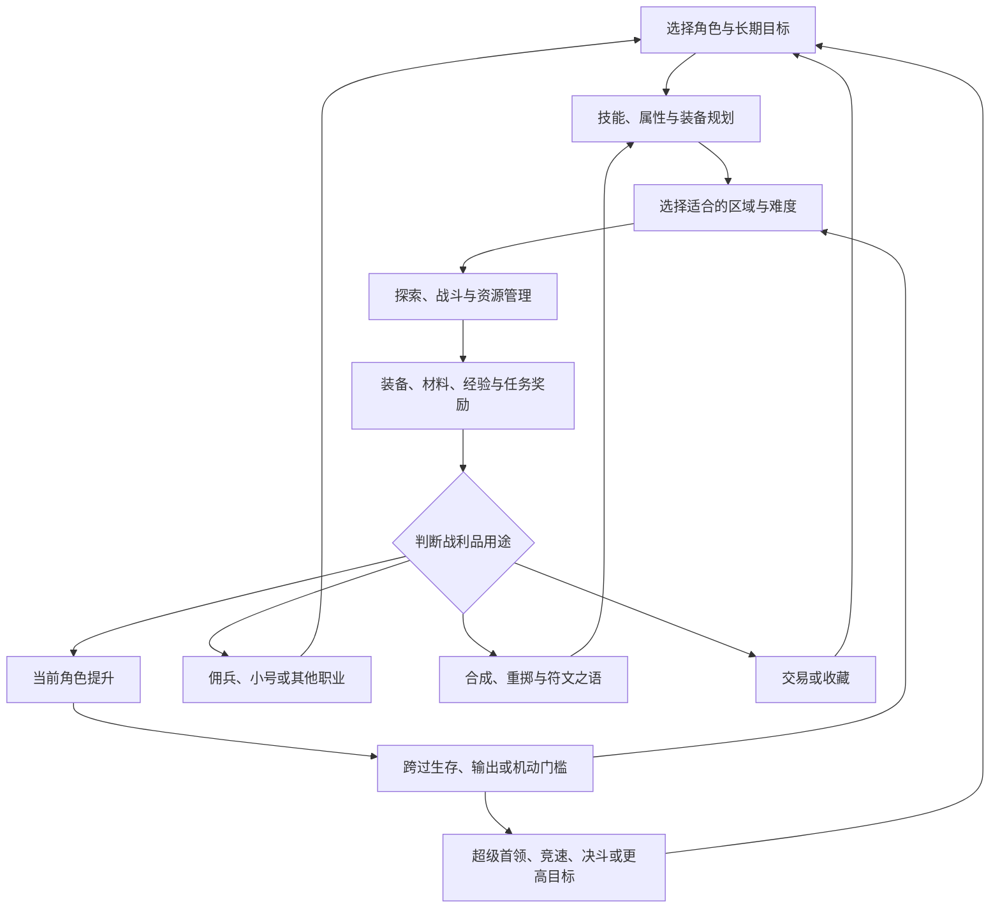

# 暗黑2耐玩性分析

调研日期：2026-09-09。本文分析暗黑2的玩法、系统联系、长期目标，以及社区玩家喜爱和不喜爱的原因。

配套文档：[本地 D2R 项目与原作差距](local-d2r-gap-analysis.md)，包含实现现状、差距、优先级和验收建议。

## 阅读范围与判断标准

“暗黑2”以经典 Diablo II 和《毁灭之王》（LoD）为主要研究对象，暴雪《暗黑破坏神 II：重制版》在本文中统一称为“官方重制版”，仅作为版本演进和社区讨论的参照。D2R 是本地项目的称呼，其实现差距由配套文档单独讨论。

本文覆盖主要系统、玩法类别、玩家目标与系统之间的关系，不逐条抄录每件装备、每个技能的完整数值。事实依据为官方规则、正式补丁及社区直接讨论；机制解释和设计取舍是本文分析，不是玩家投票结果。

社区样本主要来自暴雪论坛、Reddit 和 diablo2.io，包含较早的长期玩法讨论及 2026 年的版本反馈。它们能证明某种偏好或争议存在，不能证明其占全体玩家的比例，也不能代表整个中文社区。本文没有获得活跃用户、留存率、交易量或作弊账号比例的官方统计。

## 一、核心结论

暗黑2长期吸引人的原因，是若干系统彼此强化：

1. **装备有用途和身份。** 玩家记住的是“这件东西让我能做什么”，而不只是装备评分增加多少。
2. **成长会跨过能力门槛。** 从无法生存到站稳，从只能刷一处到能刷多处，从依赖药水到形成续航，变化可以直接感受。
3. **掉落可以服务当前角色以外的目标。** 其他职业、佣兵、交易、收藏、小号和特殊挑战都能接收战利品。
4. **构筑不只是技能树。** 它同时包含技能点、属性、底材、词缀、速度档位、抗性、佣兵、装备授予技能和目标场景。
5. **重复可以积累熟练度。** 地图识别、怪物判断、拾取判断、配装和经济知识都会转化为实际效率。
6. **玩家能够自己定义完成。** 地狱通关、第一把精神、第一次火炬、99 级、圣杯、低等级决斗，都是不同的终点。
7. **世界与反馈让循环有情绪重量。** 城镇、音乐、怪物声音、黑暗、尸体、装备外形和稀有掉落共同构成记忆。

这套结构也存在明显问题：随机过程可能长期没有有效进展；部分技能和物品缺少用途；法系、近战与移动能力的收益并不对等；交易和知识门槛对新人不友好。不能把长期玩家的偏好等同于所有设计都应保留。

## 二、版本基线：不能混用的规则

| 参照版本 | 核心内容 | 分析时的注意事项 |
| --- | --- | --- |
| Diablo II Classic | 五职业、四幕、普通/噩梦/地狱，以及相应装备与多人规则 | 不能用 LoD 符文之语、护符、佣兵装备等系统解释其全部魅力；黄色装备的地位不同 |
| LoD 后期版本 | 七职业、第五幕、符文与符文之语、护身符、珠宝、佣兵装备、协同、超级事件、洗点等 | 这些并非在资料片发售当日同时加入；1.09 与 1.10 后的装备生态也明显不同 |
| 官方重制版 早期至 2.x | 重制视听、操作便利、职业与佣兵调整、恐怖地带、破免护符和新配方等 | 后续玩法不能简单按 LoD 1.13 原样推断 |
| 官方重制版 的 Reign of the Warlock 扩展 | 增加 Warlock 职业及新的系统内容 | 应明确扩展、角色所属时代和天梯条件，不能假设所有内容向所有角色通用 |

截至本次核实，官方已发布第 15 赛季及 3.3 补丁。第 15 赛季亚洲开始时间为 2026 年 8 月 22 日 08:00 CST；公告明确部分改版物品仅适用于 Warlock 扩展天梯，不改变 Classic 或 LoD 对应物品。[第 15 赛季与 3.3 官方公告][O1]

2026 年扩展已加入 Warlock、强化后的恐怖地带及 Colossal Ancients；编年史、战利品过滤器和高级仓库也已公布上线。这些属于后续版本的系统演进，不能反推经典版本已经具有相同内容。[扩展说明][O2] [周年官方回顾][O3]

## 三、系统如何连成可重复的玩法

可以用一个定性框架判断新增功能的价值：

**有效玩法深度取决于：有意义的选择数量、选择造成的后果，以及系统之间可以发生的组合。** 这不是可直接计算的评分公式。

例如“新增 100 件主要提供近似属性的装备”，可能只增加查表和背包负担；“加入可以持有灵气武器的佣兵”，则会同时改变武器用途、破免办法、法力续航、前排站位、无形装备价值和金币消耗。

开发时应继续追问：玩家得到这个功能之后，会改变去哪里刷、留下什么、怎么配装、如何战斗、是否开新角色中的哪一项？如果答案始终只是“数字更大”，长期价值通常有限。

## 四、角色成长与构筑系统

### 4.1 属性、等级和成长节奏

LoD 的力量、敏捷、体力、精力不是四种等价的伤害属性。力量涉及装备门槛及多类武器伤害；敏捷涉及部分武器伤害、准确率和盾牌格挡；体力和精力对各职业的资源转换不同。每级获得属性点和技能点，任务奖励提供额外成长。

这里有三个重要特点：

- **装备需求会反向影响配点。** 一件高力量装备并非无成本升级，需要和生命、格挡或其他装备一起考虑。
- **等级可以解决不止一种问题。** 新技能开放、装备需求满足、命中改善和额外点数同时产生收益。
- **角色可用与等级封顶相隔很远。** 多数构筑在 99 级前已经能够完成主要内容；最后的等级是长期目标，不是开始游戏的前置条件。

但“力量敏捷够装备，剩余体力”在大量构筑中成为惯例，说明手动配点并不自动等于持续的复杂选择。格挡流、能量护盾等例外说明属性系统仍有价值，也提示改进时应该增加实际分歧，而非只是扩大数值。

### 4.2 技能树、前置、协同和洗点

经典七职业各有三系技能、每职业 30 项。硬点投入、技能等级、前置关系、协同和装备加成共同组成构筑。技能解锁之后，不代表它立即成为主力；资源、装备和协同可能仍不足。

“硬点”和“软点”区分很关键：装备提高技能等级，但不能默认把所有协同都同步提高。协同也有具体技能例外，应以所选版本为准。

洗点既降低试错成本，也保留阶段选择的意义。LoD 后期的三次任务洗点之外，还有地狱首领精华合成赦免徽章的途径。因此只有“三难度各一次洗点”，还不能算完整的后期洗点生态。[官方技能与洗点说明][O4]

成长路线本身是一种玩法：开荒技能、过渡技能和终局技能可以不同。若一个角色从一级到毕业只重复同一动作、只更换更大数值，就会削弱原作的阶段变化。

### 4.3 七职业的不同体验

下表是玩法谱系，不是当前赛季强度排名，也不表示所有列出的构筑都适合低成本单刷全部内容。

| 职业 | 三系结构 | 代表玩法 | 独特决策与吸引力 |
| --- | --- | --- | --- |
| 亚马逊 | 标枪/长矛、被动/魔法、弓/弩 | 闪电之怒、电矛、物理弓、冰弓、元素混合、毒标枪 | 穿透和怪物密度形成联动；远程站位与诱饵；武器、攻速和弹药管理 |
| 法师 | 火焰、闪电、冰冷 | 暴风雪、冰封球双修、火球/陨石、九头海蛇、新星、闪电、附魔 | 传送改变路线；专精与双修取舍；控场、法力和破免资源 |
| 死灵法师 | 召唤、毒素/白骨、诅咒 | 骷髅与尸爆、毒新星、骨矛/骨魂、召唤混合、诅咒辅助 | 第一具尸体的获取；尸体作为资源；诅咒覆盖、召唤单位和控场 |
| 圣骑士 | 战斗、攻击灵气、防御灵气 | 祝福之锤、热诚、重击、天堂之拳、复仇、装备灵气、辅助 | 近战/法术不同定位；灵气搭配；盾牌格挡；清群与打首领分工 |
| 野蛮人 | 战斗、战斗专家、战嚎 | 旋风、狂乱、狂战士、战吼、投掷、寻宝/打钱 | 双持与武器依赖；战吼提高队伍能力；寻找物品让尸体再产生收益 |
| 德鲁伊 | 元素、变形、召唤 | 风德、火德、狂怒狼、熊形、火爪、召唤、狂犬病 | 形态与操作节奏；物理/元素组合；召唤与灵提供保护和增益 |
| 刺客 | 武学、影子、陷阱 | 雷陷阱/亡者守卫、火陷阱、踢击、武学聚气、刀刃、混合 | 布置陷阱、聚气释放、尸爆接力；影散与速度爆发；控制与位置 |

官方重制版 2.4 已对大量技能、佣兵与可刷区域进行调整。例如圣光弹/天堂之拳对恶魔的适用范围与天堂之拳冷却发生变化。比较构筑时应区分这些版本规则，不能把不同版本的行为混作一套。[2.4 正式补丁][O5]

Warlock 是 2026 年扩展增加的另一套体验，三个方向围绕恶魔控制、武器魔法与混沌法术展开。它不能直接归入经典七职业，也不应凭扩展初期体验给出 3.3 的确定性最强排名。[扩展职业介绍][O2]

### 4.4 构筑其实是“任务分工”

评价构筑至少需要这些维度：开荒成本、单体伤害、清群能力、机动性、免疫覆盖、生存能力、操作压力、魔法寻获兼容性、多人辅助、超级首领能力和决斗表现。

“能通地狱”“高效刷特定区域”“低成本挑战超级首领”和“高人数全区域速刷”是不同标准。只比较满配最高伤害，会忽略很多构筑存在的理由；反过来，只证明能通关，也不能证明它与高效率构筑之间没有问题。

## 五、战斗规则：为什么配装必须联系场景

### 5.1 命中、防御和格挡是三件事

普通物理攻击的命中同时依赖准确率、防御和攻防双方等级。经典命中框架为：

`命中概率 = 2 × AR / (AR + DEF) × 攻击者等级 / (攻击者等级 + 防御者等级)`

对适用的攻击，结果限制在 5% 至 95%。法术、盾击和其他特殊技能不能机械套用所有普通攻击规则。防御主要降低被命中的概率，并不是“被打中时直接减伤”的护甲值。[官方角色规则][O6]

由此产生的玩法是：更换武器未必立即解决打不动，可能还需要等级、准确率、降防或技能调整；站位失误也不能只靠高面板伤害弥补。

### 5.2 速度档位使“刚好够”很有价值

攻击速度 IAS、快速施法 FCR、快速打击恢复 FHR 和快速格挡 FBR 对应不同规则。经典模拟节奏中的档位意味着小幅属性变化未必改变动作耗时，跨过门槛才产生可感知差别。攻击动作、职业、武器与特殊技能可能使用不同表格。

例如某动作从 10 帧降到 9 帧，理想连续动作次数增加约 11.1%，但实战提升还受走位、命中和资源限制。官方重制版 的高画面刷新率也不意味着历史档位可以忽略。

档位设计让一个低等级戒指、腰带或项链有长期用途；缺点是它不直观，游戏内应提供可理解的反馈，而不是要求新玩家先查十张表。

### 5.3 伤害类型、抗性、免疫和降抗

物理、魔法、火、冰、电、毒有不同的应对关系。角色在更高难度受到抗性惩罚；怪物则通过抗性与免疫形成区域差异。减抗、增伤、吸收和减伤的结算不能混成一个“伤害加成”。

例如在其他条件相同的情况下，元素抗性从 50% 提高到 75%，实际承受的该元素伤害会减半。这个变化可能比增加少量生命更重要。

LoD 中，审判与降低抵抗等能力在破除相应免疫时有特殊效率限制，装备减抗也不等于能够独立破免。破免护符改变了部分进入门槛，但并不意味着后续减抗、护符代价与敌人类型都不再重要。[官方抗性说明][O7] [官方重制版 破免护符介绍][O8]

设计价值在于让角色需要选择区域、准备替代伤害或使用伙伴；问题在于缺少替代方案时，免疫可能成为单纯的禁止通行。好的改进应提供有成本的办法，同时保留不同专长的价值。

### 5.4 特殊物理效果与触发技能

压碎性打击、致命攻击、撕开伤口、吸血、吸蓝、击退、防止治疗、减慢目标、无法冰冻、伤害减免、吸收，以及攻击/击中/受击触发技能，分别解决不同问题。

压碎性打击对高生命目标特别有意义，但受到目标和攻击形式等规则影响；吸血不是对每种目标、伤害和技能都有效；装备上的生命偷取与偷取生命诅咒也不是同一种效果。不能仅看物品面板就假设一次攻击会触发所有属性。[官方特殊属性][O9]

这解释了为什么看似廉价的装备组合可以针对特定超级首领表现很好，以及为什么清图毕业装不必然是打超级首领的最佳选择。

### 5.5 空间、投射物和控制

暗黑2不是所有攻击都“点中就扣血”。弹道、扇形、穿透、碰撞、攻击距离、怪物移动、狭窄通道和视野都会改变结果。

典型例子包括：祝福之锤的路径与贴身位置；闪电之怒对高密度群体的收益；陷阱在拐角的放置；尸爆从第一具尸体向整个怪群扩展；狭窄道路对召唤军团和近战包围的影响。

怪物设计也不仅是造型和血量。复活者、远程射手、冲锋者、施咒者、高爆发敌人、死亡效果和精英词缀组合，会要求玩家临时改变集火与站位。若每种敌人最终都能用相同节奏站桩解决，怪物目录再长也难以形成战斗深度。

### 5.6 药水、耐力、腰带与死亡

药水既是补给，也是即时决策资源：普通恢复与瞬间回复不同，腰带容量影响携带和使用，给佣兵喂药又形成另一层注意力分配。解毒、解冻和耐力药剂等具有特殊用途。

跑步和步行与耐力、防御、格挡的关系，构成早期探索的一部分；但其后期价值明显下降，不能把所有繁琐操作都称为深度。

普通模式的死亡涉及尸体装备回收、金币与高难度经验损失；专家模式则把死亡变为永久角色损失。前者制造短期风险，后者改变整个配装和行为准则。断线、不可读的瞬间伤害与存档损坏必须和合理的游戏风险区别对待。

## 六、装备系统：暗黑2最重要的长期内容

### 6.1 品质不是一条简单的升级阶梯

| 类别 | 为什么值得捡 | 典型决策 |
| --- | --- | --- |
| 白色/灰色底材 | 符文之语载体、正确孔数、武器速度、专属属性、无形或超强品质 | “这块底材适合哪种配方、哪个角色或佣兵？” |
| 蓝色魔法装备 | 某些高幅度词缀和特殊组合；合成、重掷材料 | 蓝装词缀少，不代表每项上限都低于黄装 |
| 黄色稀有装备 | 多属性组合，可同时补多个缺口 | 靴子、戒指、头环、武器等依靠组合而非单一分数估价 |
| 绿色套装 | 部件奖励、整套身份、过渡配装和特定用途 | 部分穿戴和整套之间是否值得放弃其他装备 |
| 暗金装备 | 固定身份与机制、变量品质、收藏 | 同名物品的变量和使用场景可能决定价值 |
| 符文之语 | 可规划制造路径、强机制组合、明确长期目标 | 材料如何分配，底材是否值得消耗稀有符文 |
| 橙色打造装备 | 固定配方效果加随机词缀 | 用可积累材料反复追求理想组合 |
| 护身符 | 背包中的额外配装层 | 技能、生命、抗性、伤害、MF 与拾取空间的取舍 |
| 珠宝、宝石、符文 | 镶嵌、加工、重掷或交易材料 | 同一材料可有直接使用、保存、制造或交换等不同用途 |

这个系统最重要的特征是：**角色等级提高，不会自动宣布所有低等级物品失去价值。** 高等级角色也可能长期使用早期能穿戴的物品；稀有度、需求等级、底材阶级、品质与实际用途不是同一个排序。

但“不按颜色线性升级”也不等于所有颜色在所有部位都同样强。某些符文之语长期挤压暗金和稀有装备的空间，是原系统真实的局限。

### 6.2 一件装备至少有六个价值维度

1. 对当前角色是否直接提升。
2. 是否能补齐一个门槛，例如抗性、施法档位或装备需求。
3. 是否适合佣兵、另一个角色或另一种构筑。
4. 是否能作为底材、合成、镶嵌或重掷材料。
5. 是否能通过交易换成当前缺少的东西。
6. 是否满足收藏、极品变量、外形或纪念价值。

例如一件自己不能穿的职业装备，在单角色且无交易的游戏里可能几乎只有卖店价值；在多职业与共享仓库环境里，它可以成为开新角色的理由。物品本身没有变，接收它的系统变了。

### 6.3 符文之语让随机掉落与可规划目标共存

正确类型的非魔法底材、准确孔数、准确顺序和符文组合共同决定制作结果。符文并非只提供一种制造配方，也可直接镶嵌并进入升级和交易循环。

玩家可以把远期目标拆成若干中期目标：先获得过渡装备，稳定刷某处，再积累符文和底材，最后完成关键配方。这种结构把“完全随机等成品”转化为“有方向的多来源积累”。

风险是某些低成本配方过强，导致大量自然掉落失去过渡价值；少量终局配方过于通用，则让不同角色最后穿得越来越像。新增配方应优先建立新用途，而不是反复提高相同位置的通用数值。

### 6.4 真正定义构筑的装备效果

装备授予传送会改变地图通行；授予战斗体制会改变准备阶段和生存；装备灵气会改变资源与伤害关系；赋予其他职业技能能产生附魔近战等混合玩法。

因此，“谜团的属性条目存在，但传送不能使用”不是仅少了一项面板数字。它缺少的是一条从装备、操作到刷图路线的完整能力。同理，无法触发的法术、无法使用的聚气和不存在的无形规则，会使相关装备的身份不完整。

### 6.5 底材、无形与佣兵共同形成另一层市场

底材具有速度、伤害范围、射程、力量敏捷需求、最大孔数、职业限制和自动属性等差异。不是找到“同类型最高级”就完成选择。

无形通常提升基础战斗数值，同时带来不可常规修理的限制；佣兵装备不消耗耐久，因此某些无形装备获得额外用途。不可破坏、自动修复或回复数量又会改变选择。弓、投掷和不同武器类型还各有边界。[官方物品基础][O10] [官方佣兵说明][O11]

没有这套关系时，收藏几十种长柄武器的乐趣会明显少于原作。先补齐一个能使用它们的伙伴系统，可能比再加入几十个名称更有效。

### 6.6 方块、打造、赌博与任务服务

赫拉迪克方块连接了许多原本独立的掉落：宝石升阶、符文升阶、物品打孔、升级底材、重掷、修理、清孔、回复药剂、打造装备、任务合成和终局入口。具体配方和模式限制依版本而异。

打造的四大家族为打击力量、鲜血、施法者、安全，固定属性与随机属性叠加，使低价值材料变成反复追求极品的机会。[官方打造说明][O12]

赌博把金币转成随机装备；商店刷新可以提供过渡底材和带技能的装备；恰西灌注、拉苏克打孔、安雅个性化等任务服务则是有限资源。它们让城镇访问不仅是清背包。

“打孔”“随机掷出孔数”“重掷魔法物品”“清除已镶嵌内容”必须分别实现规则，不能用一个万能重铸按钮代替后还称其完全还原。

### 6.7 掉落算法与刷取策略

装备需求等级、物品等级、品质等级、词缀等级、区域等级、怪物等级和宝藏类别 TC 各有作用。它们一起限制什么能够掉、什么词缀能够出现、玩家什么时候能穿。

MF 主要改变适用装备的品质概率，不提高符文等级或符文数量，也不是赌博的加成；对暗金等品质有递减收益。提高 MF 的同时若降低清怪速度，单位时间收益可能下降。[官方 MF 规则][O13]

一个便于思考的近似式是：

`某目标每小时的期望获取量 ≈ 每小时有效掉落机会 × 单次目标概率`

这不是完整掉落模拟器。实际还要考虑路线耗时、死亡、捡东西、城镇操作、怪物种类和多人掉落规则。

高人数并非按人数线性增加个人收益；离线 `/players` 与在线真实队伍也不是同一套使用条件。攻略中的 P1/P3/P7/P8 需要明确指怪物难度、掉落参数还是实际合作人数。

### 6.8 稀有掉落的正面与负面

稀有度让发现值得记忆，但也会制造很长的无进展尾部。假设某个独立掉落机会成功概率为 0.1%，则 1000 次至少成功一次的概率约为 63.2%，仍有约 36.8% 的人一次没有；“平均 1000 次”从来不是“1000 次保证拿到”。这只是概率示例，不对应具体暗黑2物品。

可持续的目标设计需要同时容纳短、中、长期回报：一次宝石或有用底材；一件阶段提升；一个高符文；以及极罕见的收藏。只有终极大奖而缺少中间收益，会把大量玩家挡在系统乐趣之外。

## 七、世界、战役、任务与探索

### 7.1 五幕不是五套颜色

| 幕 | 主要体验 | 系统作用 |
| --- | --- | --- |
| 第一幕 | 营地安全感、荒野、墓地、修道院和地下墓穴 | 建立补给、探索、任务奖励与首领的基本循环 |
| 第二幕 | 沙漠、古墓、巢穴、宫殿与神秘避难所 | 多段任务合成、道路识别、狭窄空间与符号寻找 |
| 第三幕 | 丛林、水道、废墟、议会与囚牢 | 复杂地形、快速敌人、尸体风险和多物件推进 |
| 第四幕 | 地狱堡垒、熔炉与混沌避难所 | 紧凑高潮、封印遭遇、重要永久奖励 |
| 第五幕 | 围城、雪地、冰洞、先祖与世界之石 | 战争氛围、特种怪群、角色检验和终局入口 |

原作的地图是区域网络：城镇、野外、洞穴层级、传送站、捷径和任务地点互相连接。部分区域固定，许多区域具有随机布局；离线角色的地图保留规则又让找图与长期优化形成另一种玩法。

“每次完全随机”并不是唯一正确目标。随机提供发现，固定种子提供熟练和优化；有意义的是两者如何服务玩家的目标。

### 7.2 27 个任务的不同职责

以下按 LoD 的五幕任务结构归类，中文译名因版本可能不同。任务数为 6+6+6+3+6，各幕并不是统一数量的短关卡。

| 幕 | 任务 | 核心职责 |
| --- | --- | --- |
| I | 邪恶洞窟 | 清场、技能点与后期版本洗点 |
| I | 姐妹的埋骨之地 | 血鸟遭遇与佣兵引入 |
| I | 搜寻凯恩 | 多区域线索、崔斯特瑞姆、城镇服务 |
| I | 遗忘的高塔 | 可选支线与女伯爵刷取 |
| I | 交易的工具 | 铁匠、锤子与灌注奖励 |
| I | 姐妹的屠戮 | 安达利尔与跨幕推进 |
| II | 罗达门特的巢穴 | 支线首领与技能点 |
| II | 赫拉迪克法杖 | 方块、杖身、护符和合成 |
| II | 堕落的太阳 | 世界状态改变与神殿目标 |
| II | 神秘避难所 | 宫殿至异界的路线 |
| II | 召唤者 | 日记线索与真实古墓符号 |
| II | 七个古墓 | 真假目的地与都瑞尔 |
| III | 黄金鸟 | 物品交付链与生命奖励 |
| III | 古代宗教之刃 | 吉德宾支线和城镇回报 |
| III | 克林姆的意志 | 多地点器官收集与任务武器合成 |
| III | 蓝·依森的古书 | 可选神殿搜索与属性点 |
| III | 黑暗神殿 | 议会和强制之球 |
| III | 守护者 | 墨菲斯托与剧情转折 |
| IV | 堕落天使 | 衣卒尔与技能奖励 |
| IV | 地狱熔炉 | 灵魂石、熔炉锤与材料奖励 |
| IV | 恐怖的结局 | 封印、精英组与迪亚波罗 |
| V | 哈洛加斯之围 | 山克与打孔服务 |
| V | 亚瑞特山的救援 | 囚笼、符文和佣兵服务 |
| V | 冰之囚 | 安雅、药水交互与抗性奖励 |
| V | 哈洛加斯的背叛 | 尼拉塞克与个性化服务 |
| V | 古代人的通道 | 三先祖检验与等级门槛 |
| V | 毁灭前夕 | 王座五波、巴尔与难度推进 |

任务流程的价值来自职责不同：有的教系统，有的提供永久奖励，有的建立人物关系，有的只是可选刷取地点。把全部任务统一为“点两个物体，然后打守门首领”，保留了名称，却减少了经历之间的差异。[官方任务基础][O14] [官方 NPC 说明][O15]

### 7.3 传送站、回城卷轴、城镇与捷径

传送站是长期解锁的导航节点；回城门是一次行动中的补给和回收通道；城镇 NPC 提供交易、赌博、维修、鉴定、雇佣及剧情服务。它们不只是主菜单的不同按钮。

玩家会记住从哪个传送站进、如何找出口、什么时候开门、哪些任务可以暂缓。路线知识是熟练度的重要组成部分；传送技能之所以有巨大价值，也因为它作用于真实的区域通行关系。

### 7.4 箱子、神殿和地图附属物

普通箱子、上锁箱子、特殊箱子、超级箱子、武器架、防具架、尸体、桶、石块、神殿、水井和陷阱，产生不同的交互与风险。它们的掉落规则不能统一等同于“小怪换一个模型”。

下层库拉斯特刷取之所以能形成独立玩法，是地图规律、特殊容器、种子与掉落参数共同作用的结果。若只有通用箱子的随机奖励，不能据此声称已有完整的 LK 玩法。

## 八、战役之外，玩家究竟在玩什么

### 8.1 玩法全景

| 玩法 | 玩家在优化什么 | 主要驱动力 |
| --- | --- | --- |
| 首次通关 | 生存、解题、资源分配 | 剧情推进和克服阻碍 |
| 新号开荒 | 低成本升级路线与关键装备 | 从零开始的成长效率 |
| 单人自力 SSF | 用实际掉落构建可行方案 | 自己解决问题，记录成长历史 |
| 多角色自给 | 装备在角色间的分配 | 一次掉落开启另一种体验 |
| 魔法寻获 MF | 暗金、套装与有效掉落效率 | 命名装备和收藏 |
| 符文刷取 | 怪物类型、密度、路径和掉落次数 | 符文之语与交易购买力 |
| 底材刷取 | 类别、孔数、自动属性和品质 | 制造与交易 |
| 护符/珠宝/稀有装备 | 有价值词缀组合 | 持续微调、极稀有极品 |
| 打钱与赌博 | 金币效率及赌博目标 | 材料转化为随机高价值装备 |
| 打造和重掷 | 材料积累、物品等级与配方选择 | 可规划的反复尝试 |
| 钥匙与器官 | 入口材料及分工效率 | 火炬事件与交易 |
| 超级首领 | 抗性、恢复控制和专用构筑 | 检验能力与特殊奖励 |
| 恐怖地带 | 动态刷取区域和等级效率 | 降低刷级地点单一性 |
| 99 级竞赛 | 时间、安全和团队协作 | 排名与长期达成 |
| 圣杯收集 | 全部目标的发现记录 | 世界知识与长期收藏 |
| 极品追求 | 变量、底材和稀有组合 | 在成型后继续改善 |
| 专家模式 HC | 风险预算和容错 | 高风险冒险与角色纪念 |
| PvP 决斗 | 读招、切装、档位、对局知识 | 技术、社交与对抗身份 |
| 低等级决斗 LLD | 等级/需求限制下的最优组合 | 重新激活低等级物品 |
| 速通 | 地图判读、资源与路径 | 熟练度和记录 |
| 自设挑战 | 不回刷、限制装备、限定技能等 | 对熟悉系统提出新问题 |
| 联机互助 | 组队推进、辅助、带练和掉落分配 | 与人合作的长期关系 |
| 天梯重置 | 新经济、新角色、新队伍 | 再次经历早期稀缺与成长 |
| 模组 | 自选规则、地图与装备变化 | 延伸或重解释原系统 |

SSF 与“离线”不是同义词：前者通常是自设的无交易约束，后者是存档和联机模式。SSF 是否允许自己的角色互通装备，也需要提前定义。专家模式、天梯、多人、职业与版本可以交叉，不能把它们看成互斥的单独菜单。

### 8.2 主要刷取场景为什么不同

| 场景 | 常见目标 | 与其他场景的区别 |
| --- | --- | --- |
| 女伯爵 | 中低符文、地狱钥匙 | 专用符文机制；路线与人数选择有特殊考虑 |
| 安达利尔/墨菲斯托 | 过渡暗金、首饰和通用装备 | 在角色成型前建立装备基础；目标范围受版本和区域状态限制 |
| 古代通道、地穴等高等级区域 | 高阶装备、底材与综合收益 | 怪物免疫、布局和构筑适配不同 |
| 牛场 | 大量怪物、符文、底材与材料 | 密度、范围伤害和穿透的价值突出 |
| 崔凡克议会 | 符文、金币、首饰等 | 紧凑路线，火伤与生存要求，寻找物品的额外收益 |
| 混沌避难所 | 综合装备、符文、经验 | 多类型敌人、封印和首领组合 |
| 巴尔与世界之石 | 经验、高阶掉落和推进 | 王座波次、怪物组合与等待/移动成本 |
| 皮肤剥皮者等短线目标 | 快速精英击杀与特定可掉落池 | 单次很短，长期效率依赖读取与重建房间成本 |
| 下层库拉斯特 | 特殊容器材料与符文 | 特殊箱子、离线地图种子、人数设置的交互 |
| 尼拉塞克/召唤者 | 钥匙和路线专长 | 尸爆风险、路径辨识和材料市场 |
| 恐怖地带 | 随时间变化的经验与装备 | 区域等级提升让旧地方重新有价值 |

这些是历史上常见的用途，不是固定的当前版本收益排名。恐怖地带、首领掉落调整、装备变动与不同在线市场都会改变最优路线。

### 8.3 终局事件是装备的考试

经典火炬流程包含三类钥匙、三个小型超级区域、器官材料以及超级崔斯特瑞姆。最终挑战要求处理很高的生命与恢复、抗性压力和多个敌人的关系。毁灭小护身符则与 Diablo Clone 世界事件相关，两者不是普通地狱巴尔和迪亚波罗的常规掉落。

关键不在于再放一个血量更高的首领，而在于让玩家为了挑战重新准备：抗性冗余、持续伤口、生命偷取诅咒、压碎打击、补给和引怪策略。关于特殊首领的战斗特性，可见[官方 Pandemonium Diablo 说明][O16]。

官方 2026 扩展也有新的 Colossal Ancients 挑战。后续补丁继续调整入口材料、先驱敌人与奖励，说明“入口积累需要多久”和“战斗本身多难”必须分开平衡。[扩展说明][O2] [3.2 官方调整][O17] [3.3 官方调整][O1]

这套新增玩法还包含可消耗材料选择恐怖化的幕、先驱追猎，以及以雕像开启挑战。Colossal Ancients 的击杀顺序影响最后可得的独特珠宝，给战斗增加奖励选择；具体获取率要按最新补丁核对。[扩展终局介绍][O2]

### 8.4 圣杯、极品与新角色构成长尾

圣杯是追求收齐某个版本定义下的目标物品；极品是追求同一物品更好的变量；新角色则是利用现有战利品重新体验成长。三者分别解决“没见过”“还不够好”“可以换种方式玩”。

百科展示所有条目，不等于已经有圣杯。圣杯需要“实际发现了什么”的记录，以及版本、角色、账号、离线和导入存档的清晰计数规则。

没有变量的固定暗金和符文之语，仍然可以作为第一次获得的目标，但重复发现的价值会明显下降。若同时缺少交易、其他角色用途和收藏记录，就更容易很快失去拾取兴趣。

## 九、佣兵、多人、经济和社区系统

### 9.1 佣兵是构筑的一部分

佣兵包括远程罗格、沙漠佣兵、铁狼法师和野蛮人佣兵等，具体装备许可和技能随版本变化。不能把 LoD 的旧表直接套到 官方重制版 2.4 之后。[LoD 佣兵说明][O11] [官方重制版 佣兵调整][O5]

佣兵可以承担前排、物理补伤、灵气、控制和功能装备载体等作用。玩家因此多了一套装备需求、多一种保护对象和一项死亡复活开支。

从开发角度看，一个完整佣兵需要的不仅是跟随和攻击：路径脱困、回城与跨区域迁移、装备验证、灵气作用范围、死亡和复活、治疗、存档与目标选择都影响它是否真的可用。

### 9.2 联机合作与职业互补

在支持的模式和平台上，暗黑2以房间为单位组队。玩家可以分担传送开路、清群、首领击杀、战吼、灵气、诅咒与资源支援。不能把“同一局域网打开同一网页”当作这类多人：后者要求所有人共享同一个权威世界状态。

多人还包含经验分配、怪物强度、任务资格、传送门权限、战利品分配、敌对状态和离队规则。这些规则会共同改变玩法与经济。

### 9.3 交易扩大了每次掉落的用途

玩家不必恰好掉到自己所需物品，可以把别人的需求转成自己的成长。符文、完美宝石、钥匙、底材、护符、稀有首饰等形成不同交易层次；某些外部平台还引入自己的记账单位。

价格受到赛季阶段、变量、构筑需求、交易便利和供应影响。不能给所有高符文一个永久不变的换算表，也不能把 NPC 卖价当作玩家市场价值。

这套机制的代价包括议价门槛、诈骗、外部平台依赖、现实金钱交易与作弊供应。一个物品很稀有，既可能令人兴奋，也可能让玩家转向购买；这两种结果都需要考虑。

### 9.4 PvP 创造了 PvE 之外的装备需求

决斗会重估施法/攻击/恢复档位、吸收、抗性堆叠、机动、生命、命中与技能用途。社区还会通过等级上限和自定规则限制某些装备或行为。

LLD 的意义尤其大：一件终局 PvE 看不上、但低需求且词缀优秀的物品，可能在另一套约束下很有价值。玩家自己建立的规则扩展了物品需求，而不是等待开发者持续发放新等级装备。

不过，现有敌对和决斗能力并不等于完整的现代匹配、训练、观战和赛事系统。是否应该增加这些，需要区分想要的社交体验和开发维护成本。

### 9.5 模组体现了多种不同的改进方向

PlugY、Project Diablo 2、Path of Diablo、Median XL 等体现了玩家对储存、平衡、内容、规则和角色深度的不同偏好。它们不是同一个项目，也不是都能直接安装到官方重制版；这里不能把经典 LoD 模组生态与 官方重制版 的离线数据模组混为一谈。

例如 Project Diablo 2 官方展示了地图等扩展内容，说明“给旧系统增加更多用途”是一条可行探索方向；不能据此证明所有官方玩家都想迁移到同一种模组规则。[Project Diablo 2 官方站点][M1]

## 十、社区为什么喜欢，以及为什么有人不喜欢

### 10.1 喜爱的原因及其机制

| 喜爱原因 | 系统解释 | 对设计的启示 |
| --- | --- | --- |
| 稀有发现令人记忆深刻 | 物品身份明确，掉落不总按角色投喂 | 保留意外发现，但给普通游玩提供中间回报 |
| 一点提升也能有实际区别 | 档位、抗性、技能与机动门槛 | 提升应改变行为或结果 |
| 掉到别人的装备也可能高兴 | 多职业、佣兵、仓库与交易 | 战利品需要多个接收者 |
| 低等级东西不会自动作废 | 用途、需求和数值不按物等线性替换 | 保留有特色的低中期物品 |
| 知识越多越会玩 | 规则稳定，路线与词缀可学习 | 增加可理解的信息，不抹平决策 |
| 构筑有鲜明身份 | 技能动作、伤害方式和装备机制不同 | 避免所有职业只换特效 |
| 可以按自己的节奏结束 | 通关、收藏、决斗和 99 各有目标 | 不必强迫所有人进入同一无尽进度条 |
| 单次游玩可以很短 | 刷取路线可切成数分钟循环 | 减少无意义等待与重复整理 |
| 多年角色仍有意义 | 永久模式与玩家自设目标 | 尊重存档和装备历史 |
| 视听世界有辨识度 | 地点、声音、黑暗和怪物共同表达危险 | 氛围是核心体验，不是最后加的装饰 |
| 赛季初期值得重来 | 稀缺资源重新获得价值 | 让低中期成长本身有趣 |
| 与朋友形成共同记忆 | 合作、互助、交易和讨论 | 社区行为需要可用的底层工具 |

关于装备价值和自选终局的争论，可以在玩家的[终局讨论][C1]中直接看到；2026 年的[现代化讨论][C2]同时重视装备、交易、音乐和氛围。以上机制解释是对系统的综合分析，不是对帖子内容的逐句转述。

### 10.2 不能只归因于怀旧

怀旧确实影响回归动机、情感强度和对旧操作的容忍度。多年积累的知识、朋友关系和已有装备，也会降低继续游玩的成本。

但怀旧不能完整解释玩家为什么会在数百小时后继续做拾取判断、计算档位、打造装备或开新职业。这里有可以被分析和重新实现的系统价值。

同样不能走向另一个极端：当前活跃论坛天然更容易留下愿意接受这些规则的人。已经因为重复、掉率或不透明机制离开的玩家，在样本中往往较少。不能用“我们都喜欢”推断所有新玩家都会喜欢。

### 10.3 社区并非同一种玩家

| 玩家群体 | 更看重什么 | 对新增内容的典型担忧 |
| --- | --- | --- |
| 经典版本爱好者 | 规则稳定、装备记忆、原有节奏 | 新配方和新职业改变旧装备地位 |
| 交易天梯玩家 | 经济重启、效率、市场活跃 | 作弊、通胀、过快贬值和市场分裂 |
| 离线收藏玩家 | 地图种子、可控节奏、记录与存档 | 服务依赖、仓储限制和收藏进度不清晰 |
| 专家玩家 | 可读危险、可靠操作与连接 | 断线和无法预见的死亡 |
| 构筑研究者 | 技能互动、冷门装备和实验 | 少数通用最优解长期压制其他方案 |
| PvP 玩家 | 对局规则、机动和装备细节 | PvE 平衡改动破坏对局 |
| 内容探索玩家 | 新区域、任务、敌人与故事 | 只有刷取奖励变化，没有新的冒险 |
| 时间有限的玩家 | 稳定中期进展、方便组队 | 一次游玩什么都没改善 |

这些是分析用的玩家类型，同一个人可能同时属于多类，不应当当作严格的人口分类。

### 10.4 同一种特征可以产生相反评价

- 极低掉率：有人享受终极发现，也有人长期没有正反馈。
- 免疫：有人喜欢构筑分工，也有人只感受到技能失效。
- 背包护符：有人喜欢空间取舍，也有人厌烦反复搬运。
- 自由交易：有人看到每次掉落的潜在价值，也有人看到诈骗和外部市场压力。
- 固定经典内容：有人享受熟练与掌控，也有人缺少探索的新鲜感。
- 强力符文之语：有人获得清晰目标，也有人发现自然掉落失去意义。

2026 年 9 月 4 日的一场讨论里，既有人建议分层挑战和生存场景，也有人明确反对无尽、计时和更多门票式终局。同一讨论对当前赛季机器人状况也给出相反判断。因此不能把“社区要求增加无尽模式”或“当前赛季已被机器人摧毁”写成事实。[近期直接讨论][C3]

### 10.5 应保留和应改善的阻力

有价值的阻力包括：配装占用、有限技能点、资源选择、区域风险、稀有制造材料和有代价的死亡。

较少产生价值的阻力包括：难以查找的装备、误操作丢物、输入绑定不可靠、物品描述与效果不一致、拥挤的地面标签、保存失败和难以找到合适队伍。

护符独立背包、自动拾取范围和交易便利等处于两者之间，不能简单全部归为生活质量改善。例如额外开放整片护符容量会直接增加角色强度；过滤白色底材可能让新人忽略一大类装备价值。应明确改变的究竟是操作成本还是规则。

## 十一、耐玩性扩展的取舍

理解玩家为什么喜欢原作，也需要理解新增功能可能怎样改变这种体验。以下讨论设计取舍，不是任何特定产品的缺失清单。

| 方向 | 可能收益 | 主要代价 |
| --- | --- | --- |
| 无限层数/计时终局 | 长期可比较目标 | 容易只剩最高效率构筑，改变游戏完成感 |
| 护符独立背包 | 减少整理，提高拾取空间 | 若增加生效容量，会直接抬高强度 |
| 全面个人掉落 | 减少抢取冲突 | 改变组队分配、总供给与传统体验 |
| 在线自由调人数 | 让独自刷取更灵活 | 改变组队动机、材料供给和经济 |
| 自动交易市场 | 降低交易时间 | 影响经济、社交与自动化收益 |
| 大型公共城镇 | 增强偶遇和展示 | 与房间制、氛围和部分玩家偏好冲突 |
| 赛季强力专属系统 | 快速制造新鲜感 | 永久装备贬值、版本负担与错过焦虑 |
| 大幅提高所有掉率 | 缩短成型时间 | 收藏和交易目标的寿命缩短 |
| 更广泛的模组接口 | 延长社区创作寿命 | 兼容、维护和联网信任边界更复杂 |

这张表不是否定这些功能，而是说明需要先定义服务对象和成功标准。保留旧规则分区、可选模式和充分测试，通常比强迫所有玩家共享同一种新规则更容易评估。[现代化意见分歧][C2]

## 十二、结论

暗黑2的长期吸引力来自装备身份、能力门槛、跨角色用途、可学习的规则、玩家自定目标和视听记忆的相互作用。稀有掉落需要有意义的用途与阶段回报，复杂规则需要能够被理解，重复内容需要允许积累知识和熟练度。

借鉴这些设计时，可以用一个完整的玩家经历判断结果：一次掉落能否促使玩家重新规划装备、选择路线、尝试另一种构筑、挑战新的目标，或者帮助另一个角色。具体到本地项目，见[本地 D2R 项目与原作差距](local-d2r-gap-analysis.md)。

## 来源与核查说明

正文引用沿用原调研来源。官方历史站点可能包含旧版本描述与过期模式限制，经典机制和后续正式补丁应分别使用；社区讨论证明观点存在，不代表全体玩家共识。

### 官方资料

- [O1：第 15 赛季与 3.3 补丁][O1]：当前赛季、改版物品范围、部分旧装备和终局掉落调整。
- [O2：Reign of the Warlock 扩展说明][O2]：新职业、新挑战和时代划分。
- [O3：暗黑 30 周年官方回顾][O3]：扩展与生活质量功能的官方确认。
- [O4：经典技能与洗点][O4]：技能点、装备加成和赦免徽章。
- [O5：官方重制版 2.4 正式补丁][O5]：技能、佣兵和区域调整。
- [O6：经典角色规则][O6]：命中、防御、格挡等基础关系。
- [O7：经典抗性说明][O7]：元素抗性、难度惩罚和吸收。
- [O8：第二赛季与恐怖地带/破免护符][O8]：这些系统的加入背景；当前扩展细节需看后续补丁。
- [O9：特殊魔法属性][O9]：特殊攻击属性与触发规则。
- [O10：物品基础][O10]：品质、无形、耐久和物品管理。
- [O11：经典佣兵][O11]：佣兵与装备关系；不能代替 官方重制版 新规则。
- [O12：打造装备][O12]：打造分类、固定与随机词缀。
- [O13：Magic Find][O13]：MF 的适用范围与符文、赌博等区别。
- [O14：任务基础][O14]、[任务奖励][O18]：任务与推进、奖励机制。
- [O15：NPC 系统][O15]：城镇服务与任务信息。
- [O16：Pandemonium Diablo][O16]：特殊首领战斗特征。
- [O17：第 14 赛季与 3.2 补丁][O17]：扩展平衡、人数影响、键盘移动和界面修正。

### 玩家讨论与模组

- [C1：关于暗黑2终局是否被低估的讨论][C1]：自设目标与重复刷取之间的观点分歧，属于历史样本。
- [C2：2026-08-13 起的现代化讨论][C2]：装备、氛围、多人、新地图和外观系统的不同偏好。
- [C3：2026-09-04 起的新玩法建议讨论][C3]：分层/生存玩法、门票、无尽内容和机器人状况的争论。
- [M1：Project Diablo 2 官方站点][M1]：社区模组的地图、物品和平衡方向，不代表官方重制版 的功能。

[O1]: https://news.blizzard.com/en-gb/article/24296140/diablo-ii-resurrected-ladder-season-15-now-live
[O2]: https://news.blizzard.com/en-us/article/24243863/rain-annihilation-in-reign-of-the-warlock
[O3]: https://news.blizzard.com/en-gb/article/24243862/catch-up-on-the-diablo-30th-anniversary-spotlight
[O4]: https://classic.battle.net/diablo2exp/skills/basics.shtml
[O5]: https://news.blizzard.com/en-us/article/23788293/diablo-ii-resurrected-patch-2-4-ladder-now-live
[O6]: https://classic.battle.net/diablo2exp/basics/characters.shtml
[O7]: https://classic.battle.net/diablo2exp/basics/resistances.shtml
[O8]: https://news.blizzard.com/en-us/article/23827590/diablo-ii-resurrected-ladder-season-two-has-concluded
[O9]: https://classic.battle.net/diablo2exp/items/magic.shtml
[O10]: https://classic.battle.net/diablo2exp/items/basics.shtml
[O11]: https://classic.battle.net/diablo2exp/basics/hirelings.shtml
[O12]: https://classic.battle.net/diablo2exp/items/crafteditems.shtml
[O13]: https://classic.battle.net/diablo2exp/items/magic/magicfind.shtml
[O14]: https://classic.battle.net/diablo2exp/quests/basic.shtml
[O15]: https://classic.battle.net/diablo2exp/npcs/
[O16]: https://classic.battle.net/diablo2exp/monsters/act5-pandiablo.shtml
[O17]: https://news.blizzard.com/en-gb/article/24261478/diablo-ii-resurrected-ladder-season-14-has-concluded
[M1]: https://www.projectdiablo2.com/
[C1]: https://www.reddit.com/r/Diablo/comments/17onlc2/people_dont_give_d2rs_endgame_enough_credit/
[C2]: https://us.forums.blizzard.com/en/d2r/t/d2r-doesnt-need-to-become-a-different-arpg-%E2%80%94-it-just-needs-a-few-modern-improvements/177356
[C3]: https://us.forums.blizzard.com/en/d2r/t/suggestions-and-proposals/177710
[O18]: https://classic.battle.net/diablo2exp/quests/rewards.shtml
