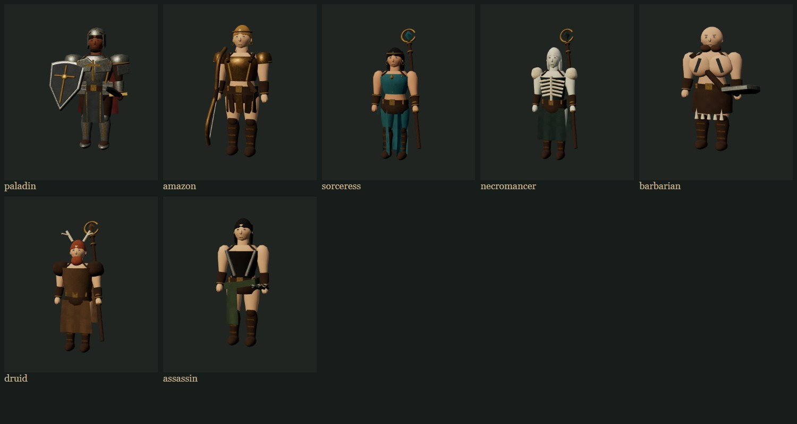
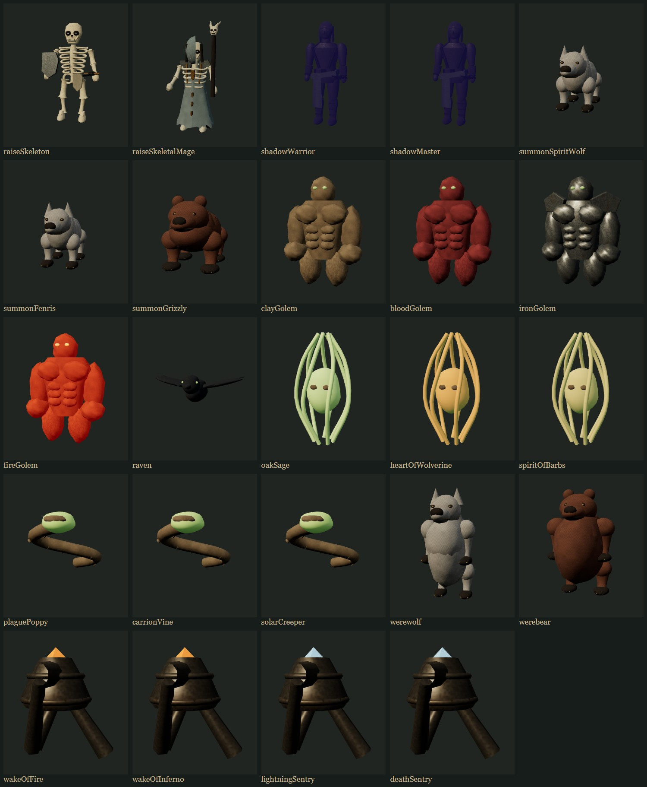
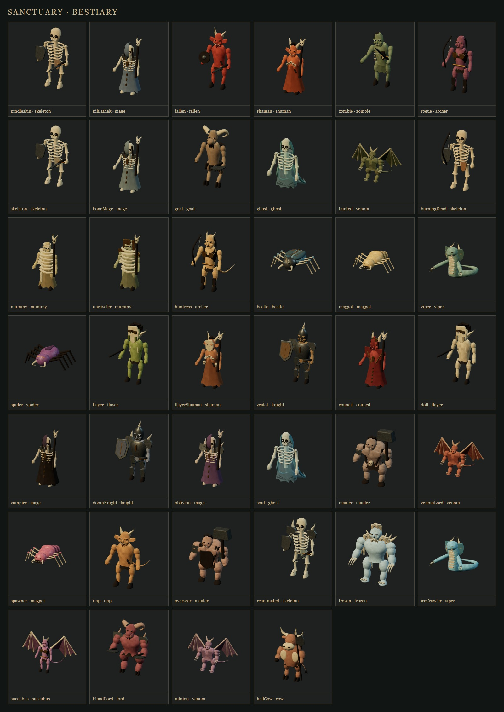
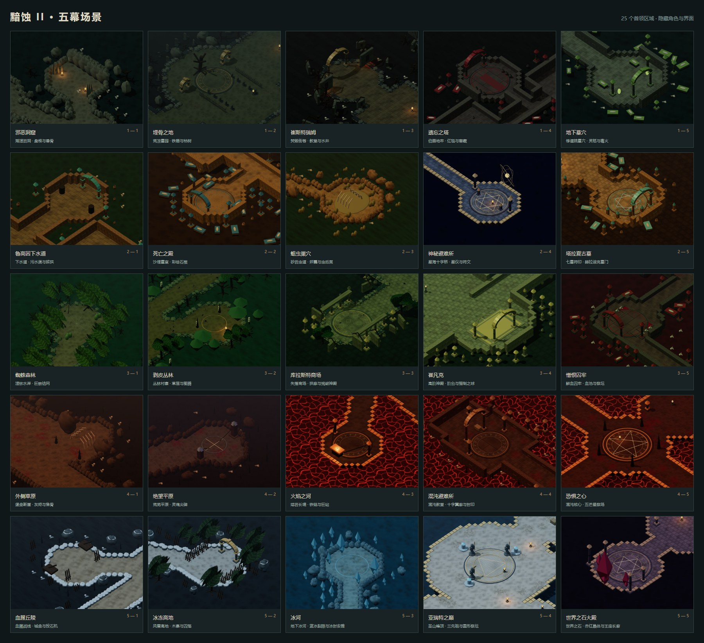

# 全模型视觉细化：第二轮

本轮继续在 `feat/refined-models-loading` 上迭代，覆盖现有七职业、65 个怪物定义使用的共用造型、召唤物、变身、陷阱以及五幕场景和营地材质。重点是减少球体拼接感、增加物种与材质差异，保留上一轮索引网格、实例化和纹理缓存。

方向参考[暴雪对重制版美术的说明](https://news.blizzard.com/en-us/article/23695734/technical-alpha-learnings)：保留原有辨识度并改善细节。这里仍是项目自有程序化模型，不是原作资产移植，也未达到原作雕刻、贴图和骨骼动画的精度。共用造型更新会影响所有使用它的怪物，但不等于每个命名变种都已单独重做。

## 造型与材质

- 人物：肩臂、膝部轮廓连续化；发型使用贴合头骨的发际线和发束，替换圆帽、方块鬓发；野蛮人和死灵法师使用不同脸宽/脸长；装备节点和攻击关节保持原有接口。
- 怪物：共用有机曲面采用连续形变，眼眶与眉骨减少方块感；牛、羊头怪、冰冻怪使用毛皮表面，蜘蛛、甲虫、沙虫、督瑞尔使用甲壳表面。
- 材质：金属提高金属度并降低粗糙度，皮肤减弱凹凸强度；毛皮纤维、甲壳沟纹和骨骼孔隙有独立程序着色，仍可通过怪物批次渲染。
- 狼/熊及变身：吻部、鬃毛、肩部和肢体收分；石魔：胸腹轮廓与铁魔护肩、火魔余烬；乌鸦：喙与分层飞羽；精灵：弯曲枝状外轮廓；藤蔓：连续管状身体和棘刺；陷阱：金属外壳、箍环与炮口。
- 场景：收分柱身、带内壁和口沿的陶罐、更细岩石轮廓、木屋门框；地表和砌石加入连续污渍与边缘缺口，营地木材增加树皮纹理。

## 可复查预览

图鉴使用固定灯光。职业武器展示预设仅用于检查造型，不改变游戏中的实际装备。

## 验证

- `npm test`：606 项通过；变身肩部调整后追加的职业/视觉相关测试 32 项通过。
- `npm run build`：通过，仍有原有的大分包提醒。
- `npm run test:models`：65 个怪物定义 / 28 种体型，正反面、攻击、移动端和反复释放通过。
- `npm run test:companions-models`：新增 31 个职业、召唤物、变身和陷阱模型的正反面检查、三角形/绘制预算以及逐模型 GPU 资源释放检查。
- `npm run test:monster-batches`：112 个模型/姿态组合的直接渲染与批渲染对照通过，包括新毛皮/甲壳着色。
- `npm run test:model-loading`：缓存所有权、确定性及淘汰；三轮场景与 40 只怪物释放后 GPU 几何体和纹理归零。
- `npm run test:scenery`：25 场景、多种种子、导航碰撞、移动端和资源预算通过。
- 地图交互测试使用 `BASE_URL=http://127.0.0.1:5173/?mode=local`，25 地图、宝箱交互、返营和手机触控通过。初次运行被源码热更新刷新打断，最终在代码稳定后重跑通过。

本轮部分曲面增加了三角形；通过了现有渲染预算，但不把视觉细化描述为普遍帧率提升，也未进行全硬件性能保证。
