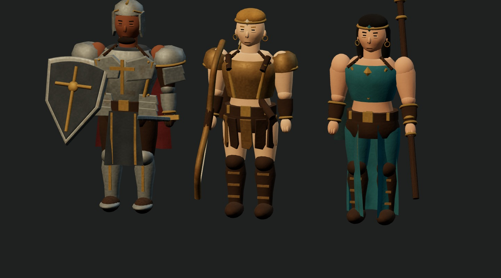
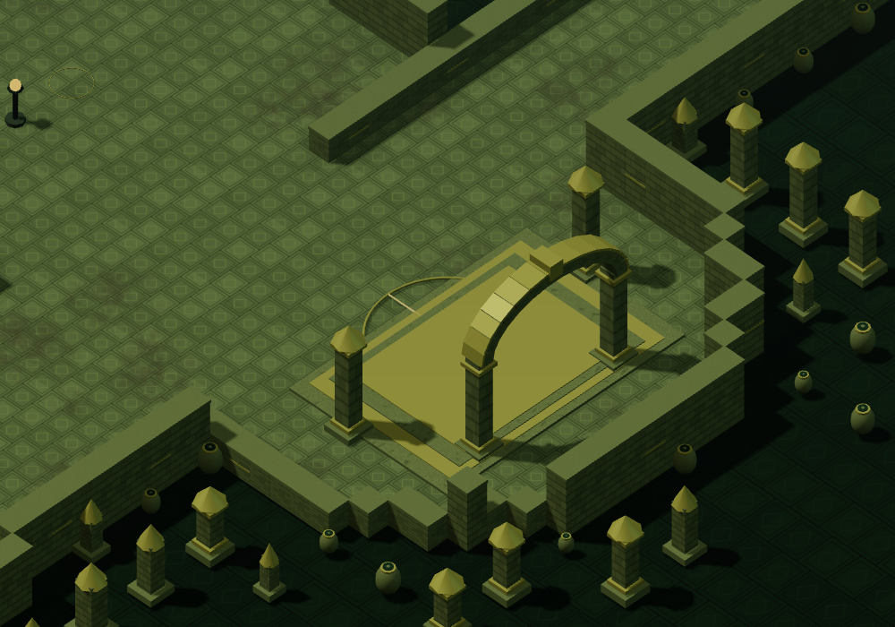

# 模型细化与加载优化（2026-09-22）

本次沿用程序化模型，改善人物、怪物与建筑的局部结构，并减少模型构建及 GPU 上传中的重复数据。它不是《暗黑破坏神 II：重制版》原版美术资产的移植；当前风格仍是程序化低多边形，距离原作的高精度雕刻、完整贴图和动画还有差距。

## 视觉变化

- 轮廓网格的 UV 接缝使用连续法线，端盖使用独立顶点，改善皮肤、骨骼和金属边缘的光照。破损长袍的端盖跟随衣摆变形。
- 七职业共用的面部网格加入颧骨、眼窝、下颌形变，补充眼睑、鼻孔及衣领缝线、铆钉。
- 非骷髅人形怪物补充颌面、鼻孔和犬齿细节，保留各自关节与攻击姿态。
- 建筑拱门改为按弧线排列的连续砌石与外沿饰条，宽入口不再使用固定长度石块拼接。

## 加载与资源管理

- 同一几何体、材质和阴影设置的重复场景物件达到 8 件时实例化。少量物件与透明贴花继续合并；实例矩阵保留旋转地图、嵌套变换及包围体。
- 人物关节合并和怪物批渲染保留索引，避免把曲面展开为大量重复顶点。单个关节部件不再做无意义的复制合并。怪物批次分别增长顶点与索引缓冲区。
- 场景纹理缓存最多 24 张 512×512 CPU 图像（RGBA 像素约 24 MiB，不含浏览器内部开销），按最近使用顺序淘汰。每次创建独立 GPU 纹理与 repeat 设置，切图释放互不影响。

地狱奶牛的单模型顶点存储从 18,240 降至 4,793，减少约 74%。该数值指顶点数量，不是总内存或帧率的同比提升。

加载专项在本机固定地图种子下测得：混沌避难所首次构建约 389 ms，后续两轮约 128 / 102 ms。每轮另加载并渲染 40 只怪物，几何缓冲统计均为 10,997,924 字节，释放后 GPU 几何体和纹理均为零。冷、热耗时包含缓存和 JIT 的影响，不是与旧版本的严格性能对比，也不包含整个游戏入口的加载时间。

## 验证

- `npm test`：606 项通过。战斗平衡测试在模型构建后重置既有种子 99，避免 Three.js UUID 消耗随机数影响战斗骰子；原有胜负、时间、药水断言保留。
- `npm run build`：通过；仍有现存的大 JS 分包警告。
- `npm run test:scenery`：25 个场景、多种地图种子、手机视图和资源预算通过。
- `BASE_URL=http://127.0.0.1:5173/?mode=local npm run test:maps`：25 地图可达性、宝箱、返营和手机触控通过。PowerShell 使用 `$env:BASE_URL` 设置地址。
- `npm run test:models`：65 个怪物定义、28 种体型，正反面、战斗及手机视图；反复释放后 GPU 资源归零。
- `npm run test:monster-batches`：112 个模型/姿态组合的批渲染、阴影、受击、尸体和隐藏状态对照通过。
- `npm run test:model-loading`：缓存命中、淘汰、确定性、独立纹理所有权，三轮场景/怪物资源释放，以及七职业渲染通过。

旧综合 `tests/memory-browser.mjs` 在本地模式完成角色预览和图鉴后，于切图返营夹具报 `Could not return to camp`，未完成后续综合检查。本次加载专项覆盖了新改动的场景、实例缓冲与怪物资源释放，不代表旧综合内存脚本已通过。

代表性帧率采样覆盖洞窟、混沌避难所及奶牛关，Intel UHD 770 / 1920×1080 自动画质。并行验证期间观测到低至约 16 FPS 的样本，奶牛关后续样本约 60 FPS；这不是受控的前后对比，不能据此宣称所有场景稳定 60 FPS。
