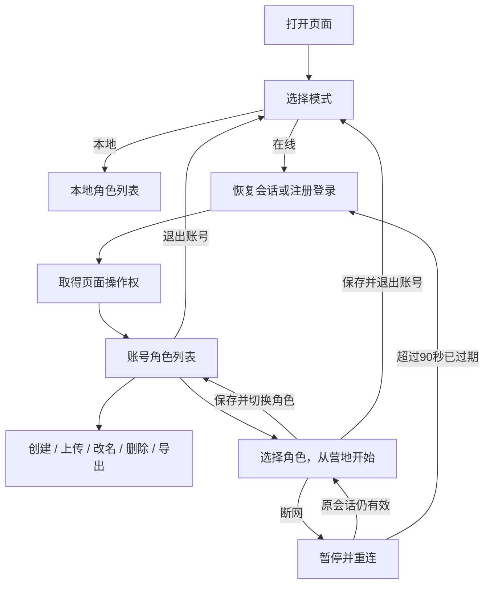

# 本地模式与在线模式

更新日期：2026-09-14。本文说明首期实现及后续扩展边界。

## 模式与角色

打开页面先选择本地模式或在线模式。已有本地角色、旧存档迁移和本地共享仓库保持原有存储方式；选择在线模式不会读取或迁移本地角色。`?mode=local` 可作为明确选择本地模式的快捷入口，也供既有浏览器回归使用。

在线模式提供注册、登录、创建角色、改名、删除、JSON 上传、JSON 导出和账号共享仓库。每个账号最多创建 20 个角色，同账号内角色名称不能重复。注册仅创建账号和空仓库，登录后由用户创建或上传角色。登录名为 4–32 位字母、数字或下划线，忽略大小写；密码为 15–128 个字符。

本地模式可继续离线游玩。在线模式保留客户端单人战斗，由服务器负责账号、会话与持久存档。客户端仍计算掉落、战斗与成长；服务端校验不构成完整反作弊，本期不提供组队、交易或竞技。



切换角色先等待保存成功，再重新载入当前模式的角色列表；不会再次占用账号。手动刷新仍显示模式选择，有有效 Cookie 时选择在线模式可恢复同一会话。切换模式采用页面重载释放旧游戏、事件监听、场景及网络任务。

## 上传与导出

角色列表的“导入”用于上传本游戏导出的单角色 JSON，最大 2 MiB。先预览职业、等级、金币与关卡，再确认“导入为新角色”；名称可修改，同名时需改名。

服务端验证文件格式及角色数据，生成新的角色 ID、物品 ID、创建时间和存档版本。原角色和原本地文件不会被覆盖；重复上传可以作为独立副本，物品 ID 不与原角色冲突。坏文件、超大文件、账号角色数量超限或写入失败时不创建半份角色。

“导出”读取当前账号在服务器上的角色，下载兼容本地模式的 JSON。包含成长、技能、装备、背包、个人仓库、魔盒、佣兵、遗体和战役进度。先从游戏中保存并切换角色，可导出最新进度。导出不包含账号、密码或账号共享仓库；需随角色转移的共享物品应先取回。

## 登录、断线和90秒超时

每个账号同一时刻最多有一个有效登录会话。另一个浏览器登录同账号时会被拒绝，不会自动顶掉原登录。正常退出先确认存档完成，再撤销服务端会话，随后可以立即重新登录。

客户端每 15 秒发送心跳。服务端从最后一次接受心跳开始计时，满 90 秒使原会话失效，并允许再次登录。登录、保存和心跳请求都会直接检查期限，不依赖定时清理任务才能释放账号；服务器重启保留数据库中的期限。会话另有 24 小时绝对有效期，达到后需重新登录。

发现断网或请求失败时客户端暂停游戏，显示重连提示，并保留页面内尚未确认的快照。请求携带固定操作 ID，重试不会重复创建角色或重复转移物品；心跳恢复后校验原会话，连接恢复后保持暂停，由用户继续游戏。

断网超过 90 秒后恢复网络，旧会话请求返回过期，页面提供“重新登录”和“返回模式选择”。重新登录后从服务端读取角色；旧页面未确认的进度不会上传到新会话。若原请求实际上已提交、只是响应丢失，则该进度仍在服务端；只存在页面内的变化不会自动覆盖服务器。

自动保存沿用 8 秒周期，并保留任务、物品、成长等事件触发的保存。成功提示只在服务端确认后出现。网络延迟、强制关闭和请求失败时不能保证最多只损失 8 秒，最终以服务器实际提交的数据为准。

同源标签页共享 Cookie，因此额外限制单个活动页面。Web Locks 在支持的浏览器上拒绝第二个页面；服务器还校验页面 ID 和递增的操作代次，旧页面的请求不能覆盖新页面。离开页面尽力释放页面操作权，失败时最迟等会话超时；页面释放不等于账号退出。无 Web Locks 的环境使用新的页面 ID，刷新若未能释放旧页面，需等待超时。

本期不提供密码找回；异常退出后等待超时即可重新登录，无需执行初稿中提出的“密码验证后退出旧会话”流程。

## 服务端与保存结构

首期采用 **Node.js 24.7+、TypeScript、Fastify 和 SQLite**。本机已验证 Node.js 24.12；密码使用 Node 内置 Argon2id（19 MiB、2 次迭代、并行度 1），会话 Token 仅以摘要保存，实际凭据使用 HttpOnly Cookie。

相比初稿建议的 PostgreSQL，SQLite 可直接随本项目运行，无需安装数据库服务或启动 Docker。数据库启用 WAL、外键和 FULL 同步，写入使用短暂的 `BEGIN IMMEDIATE` 事务。支持同一机器上的服务进程访问同一数据库文件；不应把文件放到网络共享盘供多台机器写入。以后需要多机服务时再迁移 PostgreSQL。

| 数据 | 内容 |
| --- | --- |
| users | 账号唯一键、密码哈希、创建时间 |
| sessions | 每用户唯一会话、Token 摘要、心跳期限、绝对期限、页面 ID 与代次 |
| characters | 账号归属、角色 JSON、名称唯一键、软删除时间；角色内含 revision |
| stashes | 每账号独立共享仓库与 revision |
| receipts | 同会话操作 ID、请求摘要、已提交结果；保存 24 小时 |
| rate_limits | IP/账号频率计数与期限，数据库共享 |
| migrations | 数据库结构版本 |

删除角色后立即不可读写，保留 7 天软删除记录后清理；旧保存不能使角色复活。账号共享仓库不随单角色删除。软删除不是备份。

普通保存使用串行队列，合并尚未发送的快照。每次请求携带角色版本、仓库版本和操作 ID；响应只更新确认信息，不以旧快照回写正在游玩的角色。相同操作 ID 与相同内容返回原提交结果；相同 ID 不同内容、旧版本和旧页面代次均拒绝。

共享存取先暂停操作并排空角色保存队列，然后由服务端使用自己保存的角色与仓库运行转移规则。同一事务更新角色、仓库及操作回执。失败全部回滚；重试不会复制物品。在线初始装备及上传角色的物品重新生成唯一 ID，并检查同账号角色、遗体、佣兵和共享仓库的重复持有。

角色归属始终从会话读取。所有角色读、写、上传、导出与删除检查账号归属；不属于当前账号和不存在的角色均返回 404。变更接口要求同源 Origin、JSON 内容类型及 CSRF 凭证。接口限制请求大小及请求频率；错误不会泄露数据库细节。

## 运行与部署

```powershell
npm ci
npm run dev
```

`npm run dev` 或 `start.cmd` 同时启动在线 API（默认 `127.0.0.1:3001`）和 Vite。前端通过 `/api` 同源代理访问 API。已有旧 Vite 进程需要先关闭后重新启动，才能载入新增代理配置。

仅本地模式可用 `npm run dev:local`；单独启动 API 用 `npm run dev:server`。默认在线数据库为 `server/data/online.sqlite`，目录及备份均忽略 Git。可设置 `D2R_DATABASE` 指定数据库文件，`D2R_API_PORT` 同时调整开发 API 与代理端口；独立 API 还支持 `D2R_API_HOST`。

生产部署须用同一 HTTPS 站点提供静态前端和 `/api` 反向代理，设置 `NODE_ENV=production` 以启用 Secure Cookie。代理保留原 Host；确需额外来源时，通过 `D2R_ORIGINS` 配置明确的逗号分隔来源列表，不能使用通配符。数据库仅由服务器访问。静态文件部署本身只提供本地模式，在线功能还需运行 API。

```powershell
npm run build
npm run dev:server
```

构建检查前端和服务端 TypeScript；服务端直接由 Node 执行 TypeScript 源文件，部署时需包含 `server/`、其引用的 `src/` 纯规则以及运行依赖。前端只部署 `dist/`。

使用 `npm run backup:online` 通过 SQLite 备份 API 生成一致性备份，默认写入 `server/data/backups/`；也可追加目标文件路径。备份可在服务运行时进行，不应只复制仍在运行中的主数据库文件并忽略 WAL。目标已存在时拒绝覆盖。恢复前停止服务并另存当前数据库及相关文件，使用备份恢复，再启动并验证账号与角色。

建议将备份纳入每日调度并保留至少 7 天；代码不自动上传备份或连接外部存储。账号会话和角色存档属于同一数据库，服务重启不会清空角色，也不会绕过有效登录占用。

## 代码入口与验证

| 入口 | 责任 |
| --- | --- |
| [mode.ts](../src/mode.ts) | 初始化模式、注册登录界面、恢复会话 |
| [online-client.ts](../src/online-client.ts) | Cookie/CSRF 请求、心跳、页面操作权、重试及连接状态 |
| [online-saves.ts](../src/online-saves.ts) | 在线存储适配器、串行保存队列 |
| [save-format.ts](../src/save-format.ts) | 不依赖浏览器存储的角色格式与文件解析 |
| [saves.ts](../src/saves.ts) | 原本地存储；存储键和旧档迁移保持兼容 |
| [game.ts](../src/game.ts) | 保存确认屏障、关键操作回滚、断线暂停 |
| [app.ts](../server/app.ts) | 账号、会话、角色、上传导出、仓库与操作回执 API |
| [database.ts](../server/database.ts)、[validation.ts](../server/validation.ts) | 数据库结构、事务和数据校验 |
| [backup.ts](../server/backup.ts) | 一致性数据库备份 |

`npm test` 覆盖原游戏逻辑和在线保存队列；`npm run test:server` 覆盖并发注册登录、90 秒超时、旧 Token/页面代次、账号隔离、版本与操作幂等、共享事务、上传导出、坏文件、删除、CSRF 和重启持久性；`npm run test:online` 覆盖真实浏览器在线流程。

在线浏览器测试在独立输出目录创建测试数据库，API 默认端口为 3001；若端口已占用，可通过 `D2R_API_PORT` 使用独立端口，并启动使用相同变量配置代理的测试前端。测试结束关闭自己的 API，不访问日常在线数据库。通过 `BASE_URL` 指定前端、`OUTPUT_DIR` 指定独立产物目录。测试通过可控服务器时钟验证 90 秒过期，不缩短产品的超时参数。

既有本地浏览器回归显式选择本地模式，例如：

```powershell
$env:BASE_URL = 'http://127.0.0.1:5173/?mode=local'
$env:OUTPUT_DIR = '.verification/my-local-check'
node tests/profiles-browser.mjs
```

后续扩展包括账号恢复、多机数据库部署、服务器战斗/掉落裁决和多人联机；这些不属于首期已经实现的功能。

## 记住登录

登录时可勾选“记住账号并自动登录（30 天）”，默认不勾选。浏览器仅保存用户名偏好和 HttpOnly 登录凭据，不保存明文密码；服务端只保存随机凭据的 SHA-256 摘要，生产 HTTPS 下 Cookie 启用 Secure。凭据自签发起 30 天有效，不因使用而无限续期。

再次进入在线模式时，先恢复现有会话；会话过期则使用记住的凭据建立新会话并读取服务端存档。断网超时后的“重新登录”按钮也走此流程，无需再次输入密码，但尚未上传的进度不会覆盖服务端存档。其他会话仍有效时不能抢占登录，需退出或等待 90 秒超时。

主动退出账号会撤销该账号所有记住的登录凭据，并清除当前浏览器凭据；用户名仍可预填。取消勾选后成功登录会清除当前浏览器原有记住的凭据。清除浏览器 Cookie 或超过 30 天需再次输入密码。旧数据库启动时自动增加凭据表，保留账号和存档。

在线浏览器测试可设置 `D2R_API_PORT` 使用独立测试 API 端口；测试前端的 Vite 也须使用相同变量配置代理，无需停止日常 API。

网页首次打开默认进入在线模式：未登录时显示登录表单，有效会话或记住的登录可直接恢复。通过“返回模式选择”进入本地模式；主动退出账号仍返回模式选择。显式使用 `?mode=local` 可直接进入本地模式。
