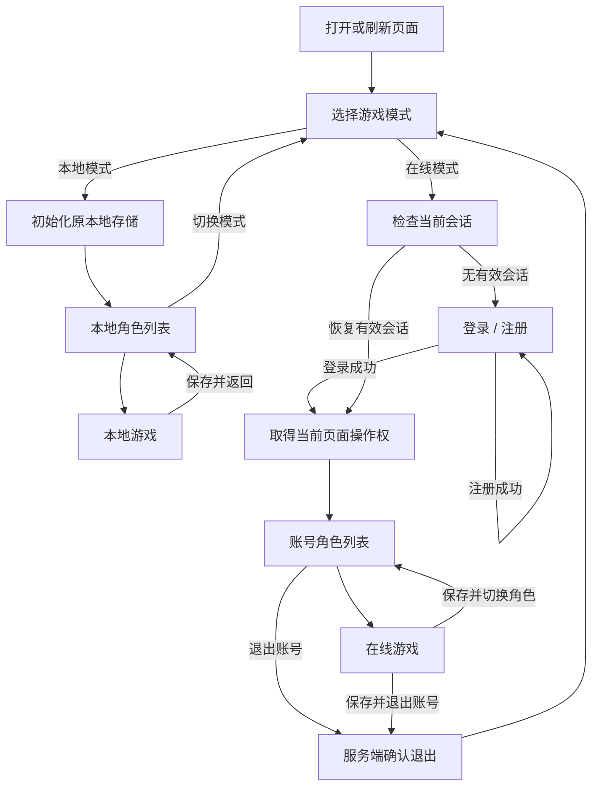
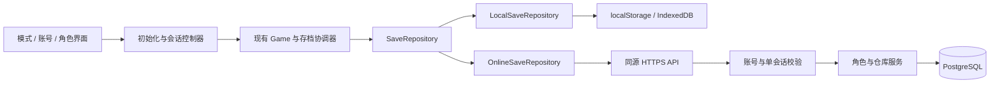

# 本地模式与在线模式开发方案

日期：2026-09-14。状态：设计稿，尚未实现在线功能。

本方案将现有浏览器存档玩法命名为“本地模式”，在初始化时新增模式选择；在线模式提供注册、登录、账号下的角色管理和服务端存档。同一账号只允许一个未退出的登录会话，已有会话时拒绝再次登录，明确退出后才能重新登录。

## 1. 功能范围与默认约定

| 项目 | 本地模式 | 在线模式第一阶段 |
| --- | --- | --- |
| 初始化入口 | 选择本地模式，进入原角色列表 | 选择在线模式，恢复有效会话或进入注册/登录页 |
| 账号 | 无需账号 | 用户名、密码注册登录；注册成功后由用户登录 |
| 角色归属 | 当前浏览器、当前访问地址 | 当前注册用户；不同用户数据隔离 |
| 角色数量 | 沿用现状 | 每个用户可创建多个角色；初始上限建议 20 个，可配置 |
| 创建与管理 | 保留创建、改名、删除、导入、导出 | 创建、改名、删除；第一阶段不提供文件导入导出 |
| 角色存档 | 现有 localStorage | 服务端数据库，服务器确认后才显示保存成功 |
| 共享仓库 | 原本地角色共用 100 格 | 同一账号的在线角色共用 100 格，数据库事务保存 |
| 游戏运行 | 沿用现有单人玩法 | 保留客户端单人战斗，需要连接在线服务 |
| 断网 | 本地资源可访问时照常游玩 | 暂停并重连，保留当前页面尚未确认的进度 |
| 切换模式 | 保存后返回模式选择 | 保存并退出账号后返回模式选择 |

不自动上传、改写或迁移已有本地角色；本地共享仓库也不与账号仓库合并。在线服务停机不影响本地模式。本地模式继续使用现有域名、端口和存储键；若更换访问地址，浏览器原有的存储隔离规则仍然适用。

以下为本轮设计采用的默认范围，可在后续实现前调整：在线角色重新创建；注册暂不要求邮箱或手机号；不加入组队、实时同步、交易、排行榜或付费系统。第一阶段的“在线”表示账号与服务端存档，不代表已经实现服务端战斗裁决或完整反作弊。

## 2. 当前实现与改造依据

| 代码入口 | 当前行为 | 改造重点 |
| --- | --- | --- |
| [main.ts](../src/main.ts) | 先刷新本地共享仓库，再直接创建 Game | 模式选择前不初始化本地存档；按模式注入存储能力 |
| [game.ts](../src/game.ts) | 构造时创建 SaveStore、迁移旧档并打开角色列表 | 拆出初始化控制器；角色载入、存档、退出支持异步 |
| [saves.ts](../src/saves.ts) | SavedProfile v2；每个角色独立键；revision 检测冲突 | 保留本地格式，新增统一存储接口及在线实现 |
| [shared-storage.ts](../src/shared-storage.ts) | IndexedDB 为共享存取提供事务，localStorage 为镜像 | 仅供本地模式使用；在线由数据库事务替代 |
| [shared-stash.ts](../src/shared-stash.ts) | 包含物品转移规则，也导入浏览器事务实现 | 抽离纯转移规则，服务端不引入浏览器存储依赖 |
| [profiles-ui.ts](../src/profiles-ui.ts) | 同步读取列表、创建、改名、删除；显示本地导入导出 | 数据加载与渲染分离；增加异步状态、账号信息与能力控制 |
| [settings-ui.ts](../src/settings-ui.ts) | 暂停菜单固定显示本地自动存档 | 按模式显示存储状态、最后确认时间和退出入口 |
| [model.ts](../src/model.ts) | HeroState、newHero、兼容旧版本的 parseSave | 复用领域类型与规则；在线请求另做严格校验 |

现有角色键为 `eclipse-ii-profile-v2:<id>`，最近角色键为 `eclipse-ii-last-profile`。共享仓库数据库为 `eclipse-ii-local-shared-v1`，兼容镜像键为 `eclipse-ii-shared-stash-v1`。这些均保留。

现有游戏每 8 秒自动保存，并在拾取、任务、装备、死亡、切换关卡等时机保存；`visibilitychange` 和 `pagehide` 也尝试保存。返回营地、购买底材、雇佣佣兵、调整人数、洗点等流程含有 `if (!save(...))` 回滚判断，不能仅把 SaveStore 换成 fetch，否则 Promise 会被误当作成功。

`newHero()` 当前包含 `starter-sword`、`starter-shield` 等固定装备 ID。在线服务创建角色时必须为所有初始物品重新分配唯一 ID，避免同一账号的不同角色向共享仓库存入初始装备时冲突。

## 3. 页面与初始化流程

每次打开或刷新都先显示模式选择，不自动进入游戏；可记住上次选择用于高亮。在线模式先调用会话查询接口：有效 Cookie 只恢复同一个会话，不执行第二次登录；恢复后仍回到角色列表，选定角色后从营地开始。

模式页提供“本地模式：角色保存在本机浏览器”和“在线模式：登录账号，角色保存在服务器”两项。在线登录页包含登录、注册与返回模式选择。账号角色页显示用户名、在线模式标识、角色列表及退出按钮；首个角色通过明确的“新建角色”操作创建。

加载、提交与重连期间显示明确状态并阻止重复点击；登录错误、角色空列表、角色读取失败分别展示。请求失败不能显示为空账号，更不能自动新建默认角色覆盖异常存档。用户名和角色名继续使用转义或 textContent 输出。

“切换角色”不退出账号；“切换到本地模式”先保存并退出账号。需要离开在线模式但无法连接时，可明确选择放弃未确认进度并返回模式页，同时提示服务端账号尚未退出，恢复连接后需完成退出；不显示“退出成功”。

初始化控制器负责页面切换及 Game 生命周期。替换目前 `returnToProfiles()` 直接 `location.reload()` 的流程，避免每次切换角色都重新走模式选择；重复切换时释放事件监听、网络请求、保存定时器、音频和场景资源。百科继续可在无需账号的入口访问。

## 4. 建议技术结构

建议在现有仓库增加 Node.js + TypeScript + Fastify 服务端，用 PostgreSQL 保存账号、会话、角色及仓库。共享类型与纯业务规则逐步提取，不引入新的前端框架。Fastify 可通过固定的 JSON Schema 校验请求及限制响应字段，适合本项目的 JSON 接口；Schema 由代码定义，不接受用户上传。[Fastify 官方说明](https://fastify.dev/docs/latest/Reference/Validation-and-Serialization/)

数据库选择 PostgreSQL，主要考虑并发登录限制、账号隔离和角色/仓库原子更新。第一阶段采用一个 API 服务和一个数据库，暂不引入 Redis、WebSocket 或微服务；账号唯一会话约束始终放在数据库中，后续增加 API 实例也不能绕过。

开发时前端继续使用 `http://127.0.0.1:5173`，通过 Vite `/api` 代理访问建议的 `127.0.0.1:3001`。生产环境用同一 HTTPS 站点提供前端静态资源与 `/api`，数据库只对服务端开放。现有静态部署仍可运行本地模式；在线模式必须部署 API 和持久数据库。具体依赖版本在实现时确定并锁定。

建议新增模块如下；表内新路径均为规划，尚未创建。

| 路径 | 责任 |
| --- | --- |
| `src/app-controller.ts`、`src/mode-ui.ts`、`src/auth-ui.ts` | 模式、账号界面与生命周期 |
| `src/auth-client.ts`、`src/api-client.ts` | 会话、CSRF、超时、错误映射、请求取消 |
| `src/save-repository.ts` | 统一异步存储契约与能力声明 |
| `src/local-save-repository.ts` | 包装现有 SaveStore，保留同步本地写入及旧档兼容 |
| `src/online-save-repository.ts` | 账号角色、云端存档、仓库 API |
| `src/save-coordinator.ts` | 保存队列、快照、重试、关键操作等待 |
| `shared/` | API DTO、存档 Schema、可供浏览器和服务端使用的纯规则 |
| `server/src/` | 入口、认证、会话、角色、仓库、数据库及错误处理 |
| `server/migrations/`、`server/tests/` | 数据库迁移和集成测试 |

后端使用独立 tsconfig 与构建入口，不沿用当前只包含 `src`、依赖 DOM 的前端编译配置。优先抽离名称规范化、角色初始状态、物品转移和存档验证的纯模块；禁止服务端导入 Game、Three.js 场景初始化、window 或 IndexedDB 模块。

## 5. 单账号单会话规则

### 5.1 登录与退出语义

“只可登录一次”定义为：每个账号同时最多有一个未退出的登录会话。已占用时，用户名和密码验证正确也返回 `409 ACCOUNT_ALREADY_ONLINE`，提示“该账号已登录，请先退出后再登录”。不会自动顶掉旧设备，也不会因关闭网页或心跳超时而自动允许新登录。

账号会话由数据库记录，不使用单独的 `users.isOnline` 布尔值或进程内 Map。正常退出流程为：暂停操作 → 完成保存 → 服务端撤销当前会话及页面操作权 → 清除当前会话 Cookie → 返回模式选择。已有未确认保存时，默认保留页面并允许重试；用户也可明确选择“放弃未确认进度并退出”，仅撤销会话。

服务端为会话凭据设置有效期，建议初始绝对有效期 24 小时，可配置。凭据到期后拒绝继续读写，账号占用转为待退出状态；不会直接创建下一次登录。此时通过下述恢复退出流程结束旧会话，再重新登录。心跳仅更新活动信息，不无限延长凭据有效期。

### 5.2 并发登录和旧请求

登录验证密码后开启短事务，锁定该用户行，再查询/更新该用户唯一的会话记录；存在未退出记录就拒绝，否则分配新的随机会话 ID 和 Token。`account_sessions.user_id` 主键提供额外约束。并发请求即使到达不同服务实例，也只有一个能成功。

所有账号状态变更，包括登录、退出、角色写入和仓库存取，使用统一锁顺序：用户行 → 会话行 → 操作记录/页面操作权 → 角色行 → 仓库行；批量角色按 ID 排序。锁只在短数据库事务内持有，不等待用户输入或网络。PostgreSQL 的 `SELECT ... FOR UPDATE` 会阻止同一行的冲突修改直到事务结束。[PostgreSQL 行锁说明](https://www.postgresql.org/docs/current/explicit-locking.html#LOCKING-ROWS)

每次写入在事务内重新校验会话 ID、Token 摘要、凭据有效期和页面操作权，不只在 HTTP 中间件中检查一次。因此“旧请求先到达，但在退出后才尝试写入”必须失败。旧会话的延迟退出只能撤销其自身 ID，不能退出后来创建的新会话。

### 5.3 异常关闭后的明确退出

浏览器关闭、进程崩溃或断电不保证触发 `pagehide`，不能把卸载回调当作账号释放和最终保存的保证。[MDN 事件说明](https://developer.mozilla.org/en-US/docs/Web/API/Window/pagehide_event)

| 情况 | 行为 |
| --- | --- |
| 原浏览器仍有有效 Cookie | 选择在线模式后恢复原会话，可继续或点击退出 |
| 关闭网页、短时断网、服务重启 | 保留账号占用，不允许别处再次登录 |
| Cookie 丢失、原设备不可用、凭据过期 | 登录页提供“退出已有登录”，重新验证用户名与密码后明确退出旧会话，再单独登录 |
| 登录成功响应丢失 | 先查询当前会话；没有收到 Cookie 时走恢复退出，不反复创建会话 |
| 密码遗忘 | 第一阶段不提供自动找回；另行制定身份核验和密码恢复方案 |

恢复退出分两步：重新校验密码后签发短期、一次性、仅能退出的凭证，绑定当时的目标会话 ID；用户看到“旧设备未保存的进度可能丢失”并确认后，撤销该目标会话。该凭证不授予角色读写权限、不直接登录。建议有效期 2 分钟，服务端只保存摘要；旧凭证不能撤销此后建立的新会话。

这样既保留“必须退出后才可再登录”的要求，也为丢失原浏览器的情况提供出口。若以后希望关闭页面一段时间后自动退出，应作为登录规则变更单独处理。

### 5.4 同浏览器多标签页

Cookie 会在同源标签页间共享，仅限制登录接口仍可能让两个标签页操作同一账号。在线模式再增加账号范围的“页面操作权”，一个账号同一时刻只有一个页面可修改角色和仓库。

每次文档加载创建新的随机 `pageInstanceId`，不复用复制标签页可能带走的 sessionStorage 标识；服务端取得操作权时返回递增 `writerEpoch`。修改请求绑定会话、页面和 epoch，其他页面显示“账号已在其他页面打开”。BroadcastChannel 用于即时提示，服务端检查才决定是否允许写入。

建议每 15 秒续约页面操作权、90 秒未续约允许原账号会话内的新页面重新取得操作权。刷新时可尝试提前释放，失败则显示等待，最迟租约到期后重新取得并从服务器载入。失去操作权的旧页面恢复时必须重新载入，不能提交旧快照。该租约只释放页面写入权，绝不释放账号登录占用。

页面隐藏时暂停游戏并尝试保存；重新可见、从 bfcache 返回或网络恢复时，先验证会话、epoch 和版本，再恢复操作。认证失效或无法确认续约时暂停，不能让冻结后恢复的页面在后台覆盖新进度。

## 6. 服务端数据设计

| 表 | 核心字段与约束 |
| --- | --- |
| `users` | `id`、`username`、`username_normalized UNIQUE`、`password_hash`、`status`、创建/更新时间 |
| `account_sessions` | `user_id PRIMARY KEY`、`session_id UNIQUE`、`token_hash`、`state`、`issued_at`、`auth_expires_at`、`last_seen_at`、`revoked_at`；每次新登录轮换 ID |
| `account_writers` | `user_id PRIMARY KEY`、`session_id`、`page_instance_id`、`writer_epoch`、`lease_expires_at`；epoch 只增不减 |
| `characters` | `id`、`user_id` 外键、`name`、`name_normalized`、`class_id`、`schema_version`、`rules_version`、`hero JSONB`、`revision`、创建/更新时间、`deleted_at` |
| `account_stashes` | `user_id PRIMARY KEY`、`schema_version`、`items JSONB`、`revision`、更新时间 |
| `mutation_receipts` | `user_id`、`session_id`、`operation_id`、操作种类、目标、请求摘要、结果及到期时间；三元组唯一 |
| `logout_challenges` | 凭证摘要、`user_id`、目标 `session_id`、过期时间、已使用时间 |
| `audit_events` | 注册、登录拒绝、退出、恢复退出、删除、冲突、迁移等事件；不记录密码、Token、完整存档 |

角色 ID、用户归属、时间戳和 revision 由服务器生成；创建角色只接收名称与职业，由服务端构造初始 HeroState。在线数据使用独立 envelope，不以客户端提交的 SavedProfile 元数据为准；`schemaVersion` 表示数据结构版本，`rulesVersion` 表示游戏规则版本，二者不能混用。

角色名称沿用当前 NFC、空白规范化和 1–16 字符限制；同账号内忽略大小写后唯一，不要求全服唯一。数据库为未删除角色建立 `(user_id, name_normalized)` 唯一索引，角色数量限制在用户锁内检查。用户名建议先限制为 4–32 位 ASCII 字母、数字和下划线，以小写形式判断重复。

删除角色需确认并检查版本，先软删除，建议保留 7 天后清理；普通读写立即不可见，不允许旧自动保存复活。角色名删除后可重用，角色 ID 永不复用；账号共享仓库不随单个角色删除。数据库备份另行保留，软删除不替代备份。

普通快照提交必须验证：结构/版本、有限数值及范围、合法职业与技能/物品定义、数组和容器容量、物品 ID 唯一性、装备/遗体/魔盒等容器一致性，以及与账号其他角色和共享仓库的 ID 冲突。初始总请求上限建议 2 MiB，嵌套深度与各数组上限单独限制；上线前用大容量角色和仓库样本校准。

在线请求不直接使用当前宽容的 `parseSave()` 作为验证器：旧档解析可修复或补齐字段，在线错误请求则应明确拒绝。版本迁移只针对服务器已有记录，迁移前备份、成功后递增 revision；未知新版本返回 `CLIENT_UPDATE_REQUIRED`，不能按空档处理。

客户端仍计算战斗、掉落和成长，严格结构校验无法证明一次掉落或升级真实发生。即使关闭文件导入，修改客户端或伪造合法快照仍可能作弊；本阶段保证账号归属和正常请求下的数据一致性。将来引入交易或竞技前，需要增加服务器生成物品与结算战斗的方案。

## 7. 存档协调与共享仓库

### 7.1 存储接口与调用改造

统一接口包含 `list/read/create/rename/delete/save/readShared/transferShared`，使用 Promise 表示实际完成；通过能力字段控制导入、导出和离线支持。本地适配器包装现有 SaveStore，不改变原存储格式，保留本地关闭页面时可立即完成写入的路径。最近角色选择也由适配器管理：本地沿用原键，在线按账号保存独立的界面偏好，不能复用本地最近角色 ID。

存档协调器提供两类入口：`requestSave()` 标记变化并安排保存，适用于战斗循环；`flush()` 等待全部必要保存真正成功，适用于退出、切换角色和操作屏障。具体命名在实现时确定，调用方不能把“请求已排队”当作“已持久保存”。

现有 `if (!save())` 调用点逐个改为等待明确结果。购买、雇佣、洗点、返回营地、切关、共享存取等关键操作在执行时暂停会改变角色的操作，以快照计算结果，成功后应用或继续，失败则保留原状态；所有相关 UI 事件需处理异步错误。保存快照与载入流程继续遵循现有死亡、遗体和营地恢复规则，不能因增加异步保存而重复扣除死亡代价。

### 7.2 保存时序

1. 每个账号页面使用一个串行修改队列，普通存档与仓库操作不能并行提交。
2. 捕获不可变 HeroState 快照，携带 `expectedRevision`、`expectedStashRevision`、`operationId` 和页面 epoch。元数据 revision 只使用上次服务端确认值。
3. 保留现有 8 秒周期；已有重要事件继续触发及时保存，连续普通事件可短暂合并。单次请求期间新增变化标记为下一批，不能被本次成功回执清除。
4. 成功后更新确认版本和时间。普通自动保存响应不把旧快照重新赋给正在推进的 `game.hero`；关键屏障内才应用服务端完整结果。
5. 超时表示结果未知，暂停游戏，保留原 operationId 与原请求体，重试或查询操作回执；在结果确定前不发送后续修改。
6. `401`、页面操作权丢失或版本冲突时冻结写入并引导重新载入；`5xx`/网络故障以退避重试。重连先检查原会话、页面操作权和 revision，条件已变化就不上传旧状态。

服务端收到已认证请求后，先在用户事务锁内查找该会话的 operationId。相同 ID 和相同请求摘要返回已提交结果，相同 ID 不同内容返回 `409 OPERATION_MISMATCH`；新操作再验证页面写入权及版本并执行。回执与数据在同一事务落库，建议保留 24 小时，客户端超出重试窗口只允许重新载入。

普通存档使用带归属、revision 和未删除条件的更新，并递增 revision。检查账号仓库版本和跨角色物品 ID 时也持有同一账号锁。冲突不做装备或金币的自动合并，也不覆盖服务器的新版本。

界面区分“待保存”“正在保存”“已保存 HH:mm:ss”“连接中断，游戏已暂停”和“存档已更新，请重新载入”。最后保存时间只取服务端回执。浏览器关闭前的发送属于尽力而为；突然关闭可能失去最后一次服务端确认后的进度，不承诺固定的 8 秒损失上限。

### 7.3 共享仓库事务

共享存取先冻结角色变更并 `flush()`，再发送“存入/取出/换装/卸下/移动”指令与双方版本。服务端加载自己的角色和仓库记录，运行抽离出的物品规则；不接受客户端提交的整份仓库作为转移结果。

一次数据库事务同时更新角色、仓库、双方 revision 及操作回执，任一步失败全部回滚。客户端收到成功结果后同时应用角色和仓库；响应丢失时使用相同 operationId 恢复结果，不能重复取出物品。此后普通存档必须使用新的双方版本，阻止旧快照把已存入仓库的物品恢复到角色。

账号下的初始装备与后续物品均使用唯一 ID；服务端检查同账号所有未删除角色持有物品、遗体与共享仓库中的重复 ID。该检查用于发现重复持有，不能替代掉落真实性校验。

### 7.4 保存并退出

正常退出先冻结输入并排空待处理事务，随后调用退出接口，可附带最后一份脏快照及版本。服务端在同一事务内完成最后保存、记录回执、撤销页面操作权和当前账号会话，提交后才返回成功。

最后保存失败则不撤销会话；显式放弃进度的退出请求不附带快照。退出响应丢失时允许原会话 Token 摘要查询/重试该次退出结果，仅返回退出完成状态，不授予已撤销会话任何其他权限；不得将后续新会话一起退出。

## 8. API 草案

统一前缀 `/api/v1`；以下路径均为拟新增接口。需登录接口从服务端会话获得 userId，不接受请求体指定数据所属用户；不存在和不属于当前账号的角色统一返回 404。

| 方法与路径 | 用途与关键输入 |
| --- | --- |
| `POST /auth/register` | 用户名、密码；创建用户与空账号仓库，不自动创建角色或登录 |
| `POST /auth/login` | 用户名、密码；占用检查通过后设置会话 Cookie |
| `GET /auth/csrf` | 提供表单请求的 CSRF 凭证；未登录时使用短期预认证 Cookie，不占用账号会话 |
| `GET /auth/session` | 当前用户、会话状态/到期时间和 CSRF 信息；不创建新登录 |
| `POST /auth/heartbeat` | 更新会话活动信息，不释放占用或延长绝对有效期 |
| `POST /auth/logout` | 退出当前会话，可带最后存档、预期版本与 operationId |
| `POST /auth/logout-challenge` | 重新验证密码，创建仅用于退出目标旧会话的一次性凭证 |
| `POST /auth/logout-existing` | 消费该凭证，明确退出其绑定的旧会话，不自动登录 |
| `POST /writer/acquire` | 当前会话为页面申请操作权，返回 epoch 与期限 |
| `POST /writer/heartbeat` | 校验页面与 epoch 后续约操作权，可合并账号心跳 |
| `POST /writer/release` | 显式释放当前页面操作权，不退出账号 |
| `GET /characters` | 当前账号的角色摘要列表，包含 revision；不返回所有 HeroState |
| `POST /characters` | 名称、职业、operationId；服务端创建初始角色 |
| `GET /characters/:id` | 返回角色完整状态及账号仓库 revision |
| `PATCH /characters/:id` | 改名，要求 expectedRevision 与 operationId |
| `DELETE /characters/:id` | 删除，要求 expectedRevision 与 operationId |
| `PUT /characters/:id/save` | HeroState、两个预期版本、operationId；服务端版本检查 |
| `GET /stash` | 当前账号共享仓库及 revision |
| `POST /stash/transfer` | characterId、转移指令、两个预期版本、operationId |
| `GET /operations/:id` | 当前会话已提交操作的回执，用于结果未知时恢复 |

角色及仓库修改均要求当前页面操作权；正常退出允许同账号有效会话撤销自身，附带存档时还必须验证页面操作权。操作回执不存在不能证明之前的请求不会提交，应继续复用同一 operationId 重试。

统一错误结构建议为 `{ code, message, requestId, details? }`。主要错误：`INVALID_CREDENTIALS`、`USERNAME_TAKEN`、`ACCOUNT_ALREADY_ONLINE`、`SESSION_EXPIRED`、`SESSION_REVOKED`、`WRITER_BUSY`、`WRITER_LOST`、`SAVE_CONFLICT`、`STASH_CONFLICT`、`OPERATION_MISMATCH`、`CHARACTER_LIMIT`、`INVALID_SAVE`、`CLIENT_UPDATE_REQUIRED`。认证失败用 401，无权操作用 403，资源不可见用 404，状态/版本冲突用 409，超限用 413/429，存档业务校验失败用 422。

## 9. 账号安全与部署要求

密码使用 Argon2id 加盐哈希，建议以至少 19 MiB 内存、2 次迭代、并行度 1 为起点，根据部署机器验证耗时；密码不进入日志、存档或明文数据库。[OWASP 密码存储建议](https://cheatsheetseries.owasp.org/cheatsheets/Password_Storage_Cheat_Sheet.html)

会话采用密码学随机的不透明 Token，数据库只保存摘要；生产 Cookie 设置 HttpOnly、Secure、SameSite=Lax，限制为本站，不写入 localStorage 或 URL。所有变更接口校验 Origin 和 CSRF，登录与恢复接口也限制来源及内容类型。退出在服务器撤销 Token，清理当前会话 Cookie；认证与存档响应使用 `Cache-Control: no-store`。[OWASP 会话管理说明](https://cheatsheetseries.owasp.org/cheatsheets/Session_Management_Cheat_Sheet.html)

密码输入建议 15–128 个字符，允许粘贴，不静默截断或裁剪密码。登录错误统一提示账号或密码错误，密码通过后才能返回账号占用信息。注册、登录、恢复退出按 IP 与账号进行限流；账号计数需在数据库或其他共享存储，避免多 API 实例绕过。公开部署前压测哈希并发，避免大量密码请求耗尽资源。

前端只保存界面偏好；退出或换账号时销毁在线角色、仓库与请求队列缓存，不留下另一账号的列表。异步响应带所属模式、账号和控制器代次，切换后迟到的响应直接丢弃。服务端凭据和数据库配置只从环境读取，前端构建变量不能包含秘密。

部署需要数据库迁移、持久卷、健康检查和备份恢复流程。建议每日完整备份并保留 7 天，第一阶段故障恢复可能损失最近一次备份后的数据；如需更小恢复窗口再配置持续归档。版本升级前做备份和恢复演练，新旧客户端不兼容时明确要求刷新。只回滚前端不能假定数据库格式自动回滚。

服务器重启不清空账号占用；页面租约按数据库时间判断。日志重点记录登录占用拒绝、保存延迟/失败、版本冲突和恢复退出事件，支持按 requestId 排查，不记录认证头、Cookie、密码和完整角色负载。

## 10. 分阶段开发与验收

| 阶段 | 交付内容 | 完成条件 |
| --- | --- | --- |
| P1：模式与存储解耦 | 模式页、初始化控制器、存储接口、本地适配器、保存协调器；在线入口先显示开发状态 | 原有本地存档不变，异步调用改造无回归，反复切换无监听/场景泄漏 |
| P2：账号与会话服务 | 数据库迁移、注册登录、单会话、页面操作权、退出及异常退出恢复 | 并发登录只能成功一个，退出后可再登录，重启/多实例/旧请求均不能绕过 |
| P3：在线角色与保存 | 账号角色 CRUD、服务端初始角色、保存队列、版本控制、幂等和断线界面 | A/B 账号隔离，响应丢失可恢复，旧快照被拒绝，保存成功后跨设备可读 |
| P4：账号共享仓库 | 纯规则抽离、仓库事务、完整换装/拖动接入、保存退出闭环 | 不丢失/复制物品，普通存档与仓库存取时序一致，本地/在线数据不串用 |
| P5：交付与部署 | 浏览器回归、服务端集成测试、部署脚本、备份恢复和用户说明 | 下列验收全部通过后，再将在线模式标记为可用 |

关键验收用例：

1. 带有历史角色、共享仓库、旧版本备份的浏览器进入本地模式，所有数据可读；选择在线模式不触发本地迁移或读写本地角色。
2. 注册重复用户名的并发请求只有一个成功；相同账号同时发出至少 20 个登录请求仅一个成功，其他返回账号已登录。
3. 两个独立浏览器中，A 登录后 B 被拒绝；A 明确退出后 B 能登录；A 的旧 Token、旧保存、旧退出不能修改 B 的新会话和存档。
4. 同源两个标签页共享 Cookie 时只有一个页面可修改；刷新、复制标签、bfcache、隐藏后恢复、租约过期均验证 epoch，且不会因此允许账号再次登录。
5. 杀死浏览器进程、丢失 Cookie、过期凭据后，通过恢复退出再登录成功；过期或已使用的退出凭证不能影响新会话。
6. A/B 账号直接修改 URL、角色 ID 或伪造 userId，均不能查看或修改对方数据；切换账号后无旧列表或迟到响应残留。
7. 三职业创建、改名、删除、20 角色上限、大小写同名竞争、软删除后旧请求、首次装备 ID 唯一性全部验证。
8. 保存提交成功但响应丢失，重试不重复增版本；同 operationId 不同负载被拒绝；保存期间继续产生进度不会被旧响应回滚。
9. 断网/服务器 500/数据库写失败时显示未确认状态并暂停；网络恢复按原版本和会话恢复，冲突时不能自动覆盖。
10. 共享存取、穿脱、拖动、满仓、连续取出和响应丢失，均保持物品唯一及双方原子更新；旧普通存档不能恢复已转移物品。
11. 保存并切换角色、返回营地、购买、佣兵、洗点、死亡和保存退出分别验证成功与失败分支；退出最后保存失败不得显示已保存。
12. 服务重启和两个 API 实例共享数据库时单会话仍成立；超大/损坏/未知版本存档、限流、CSRF 和备份恢复验证通过。

实现阶段按项目约定运行 `npm test`、`npm run build`，补充服务端集成测试命令；现有浏览器回归至少覆盖角色管理、角色导入导出、本地共享仓库、拖动、营地返回、人数设置和 UI。既有测试的初始化助手需显式选择本地模式，新增在线测试使用独立账号、独立浏览器上下文与测试数据库。地图/场景若发生修改，再运行 `npm run test:maps` 和 `npm run test:scenery`。

测试数据库必须是专用实例或明确隔离的测试库，清理仅限该次创建的账号和数据；验证前后记录产物，不删除既有 `.verification/`、存档或依赖目录。本轮只检查方案内容、链接和 Git 差异，不运行游戏构建，也不代表上述实现验收已完成。
