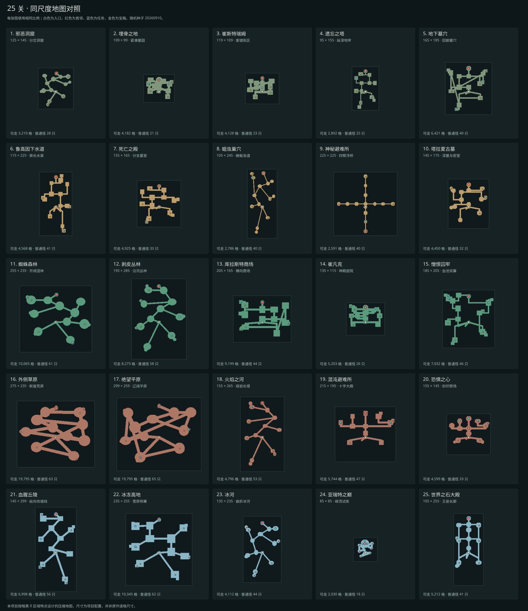

# 随机远征与探索平衡

25 关采用独立长宽的战斗网格，从亚瑞特之巅的 85 × 85 到绝望平原的 299 × 259，两个方向均不超过 300 格。墓园和城镇废墟紧凑，丛林和荒原开阔，虫道、下水道、攻城战线及王座大殿明显狭长。尺寸表是本项目对《暗黑破坏神 II》区域特征的压缩改编，并非原作逐格尺寸。

尺寸同时影响真实地形节点间距、房间面积、侧室数量和怪群数量。每关仍按种子改变路径和房间；外伸支路上限从峰顶的 0～1 条，到丛林荒原的 4～6 条。角色速度、模型比例和门洞宽度保持原有战斗尺度。实际可走面积由地形决定，不能把矩形边界面积当作探索面积。

上图使用相同世界比例，直观展示每关实际地面与长宽差异。运行 `node scripts/map-footprints.ts` 可在 `.verification/map-footprints.svg` 生成对照图；`MAP_SEED` 指定种子，`OUTPUT_FILE` 指定输出文件。

每次从营地出发、重新挑战、进入下一关或切换难度，都会生成新的布局、装饰分布、任务支路、宝箱位置和怪群计划。在当前地图死亡后复活、打开菜单或关闭关卡选择不会刷新地图。返回营地再出发会刷新；未拾取的地面物品遵循原有离场规则。任务编号、通关记录和永久奖励兼容旧存档，未完成关卡的营地续玩保留已完成目标，尸体按原有规则移至入口。

## 25 关设计

各关保留原有材质、天气、照明和首领地标，完整视觉配置见 [五幕场景](scenes.md)。随机生成围绕下表的空间结构展开。

| 关卡 | 网格长宽 | 保留的区域特征 | 本次随机探索设计 |
| --- | --- | --- | --- |
| 1 邪恶洞窟 | 125 × 145 | 潮湿岩壁、盘根、兽骨 | 扭曲洞室与外伸袋状侧洞；清怪后寻找深处巢穴 |
| 2 埋骨之地 | 109 × 99 | 铁栅墓园、枯树、墓碑 | 扩大墓地双翼与墓室，净化目标落在不同侧室 |
| 3 崔斯特瑞姆 | 119 × 109 | 焚毁街区、水井、凯恩广场 | 保留广场中心，街巷环路与外围废屋变化 |
| 4 遗忘之塔 | 95 × 155 | 直角地牢、红毯、窖藏 | 支路尽头藏室变化，典籍与宝箱分散在地牢侧翼 |
| 5 地下墓穴 | 165 × 185 | 修道院门廊、石棺、毒火 | 延长墓穴回廊，两座火盆分布在不同探索房间 |
| 6 鲁高因下水道 | 115 × 225 | 平行排水廊、污水渠、砖拱 | 沿水渠扩展侧室，死者之书位置随布局变化 |
| 7 死亡之殿 | 155 × 165 | 砂岩墓门、彩绘石棺 | 方形墓室与直角分岔，方块藏室在支路中变化 |
| 8 蛆虫巢穴 | 105 × 245 | 狭窄虫道、卵囊、虫后巢 | 不增加外围捷径，长窄道接袋状巢室；每群固定两只 |
| 9 神秘避难所 | 225 × 225 | 中心平台、四臂浮桥、星仪 | 四臂长度及平台尺寸变化；日记和召唤者随机位于同一臂，四臂只能经中心互通 |
| 10 塔拉夏古墓 | 145 × 175 | 七墓符印、独立墓门与首领室 | 墓道和侧墓室变化，祭台位于探索支路 |
| 11 蜘蛛森林 | 255 × 235 | 湿林水岸、巨蛛结网 | 不规则林间空地、侧洞与遗物箱位置变化 |
| 12 剥皮丛林 | 195 × 285 | 曲折岸道、短桥、草屋图腾 | 扩大村落空地和岸边岔路，祭台在支线村落中变化 |
| 13 库拉斯特商场 | 205 × 165 | 街区、拱廊、残破神殿 | 商场街道增加随机捷径与外侧殿室 |
| 14 崔凡克 | 135 × 115 | 神殿阶台、议会庭院 | 保留双翼进路，庭院尺寸与外伸侧殿变化 |
| 15 憎恨囚牢 | 185 × 205 | 血池、两翼回廊、墨菲斯托台地 | 保留正面隔断，从两翼探索祭台后接近台地 |
| 16 外侧草原 | 275 × 235 | 灰烬荒原、焦骨、断崖 | 大型不规则空地与可变连接，分散恶魔先锋 |
| 17 绝望平原 | 299 × 259 | 灵魂尖碑、荒原峡口 | 开阔战场与外缘支路变化，枷锁分散在探索房间 |
| 18 火焰之河 | 155 × 265 | 熔岩、玄武岩岛、巨砧 | 长堤与岛屿间隔变化，支路连接熔炉任务区 |
| 19 混沌避难所 | 215 × 195 | 十字主殿、外环封印翼廊 | 保留两处封印所在翼廊，增加可变外侧房间 |
| 20 恐惧之心 | 155 × 145 | 中央五芒星、三翼封印 | 保留三翼封印和中央首领场地，外翼尺寸与侧室变化 |
| 21 血腥丘陵 | 145 × 299 | 纵向战线、木垒、攻城器械 | 错列战斗空地和外侧岔路变化，攻城目标分散 |
| 22 冰冻高地 | 235 × 255 | 雪地木寨、囚笼侧翼 | 放大侧寨与营地，囚笼在探索房间中变化 |
| 23 冰河 | 135 × 235 | 蓝冰裂隙、地下冰岸 | 曲折冰道与分支冰室，安雅所在冰室变化 |
| 24 亚瑞特之巅 | 85 × 85 | 峰顶大平台、三座先祖雕像 | 进山路线和外缘侧台变化，三雕像保持在完整试炼平台内 |
| 25 世界之石大殿 | 105 × 255 | 长轴王座、双侧回廊、赤红晶石 | 保留仪式主轴和末端大厅，侧廊尺寸与支室变化 |

原作部分首领区域本来是固定地图，见 [暴雪地图随机化说明](https://classic.battle.net/diablo2exp/basics/)。本项目按“每次进入都有变化”的目标，保留这些区域的地标与结构，随机化外围和进路；仍是五幕各五关的压缩改编，不包含原作全部楼层、楼梯、传送平台或原版拼接算法。

## 战斗与收益预算

怪群候选点来自任务房间、主路、侧室及长走廊中段。任务守卫优先，其余采用离已占位置更远的候选点，以覆盖探索范围。入口周围 15 格、补给周围 12 格、首领周围 10 格不放普通怪群中心；实际站位在中心周围按近战前排、远程和支援后排展开，并投影到真实可达地面。

普通怪群上限按区域配置为 8～28 群：峰顶与墓园较少，纵深地牢居中，大型野外较多；空间不足时取实际数量。一般每群 2～3 只，虫道与星空浮桥每群两只，初始普通怪最多 84 只。沿用视线、同群警戒和远处脱战机制，不因地图变大扩大仇恨半径。精英继续按普通 1～2、噩梦 3～4、地狱 5～6 只生成，优先分散在侧室、宝箱附近和外围支路；紧凑区域允许较短的精英间距，补充使用房间角落，保持精英数量且远离入口。

普通怪经验按该区域旧有普通怪预算归一化：`本次普通怪经验系数 = 旧怪群物种经验权重总和 × 1.20 / 本次物种经验权重总和`。权重沿用物种基础生命平方根并限制在 0.7～1.4；等级差、70 级后经验衰减及装备经验加成仍正常生效。经验在击杀时发放，未探索的怪物不会自动给经验。最初几级逐怪取整带来小幅误差。

普通怪掉落使用独立的 `min(1, 旧普通怪数量 × 1.15 / 本次普通怪数量)` 判定，通过后才进入原有掉落表，因此增加面积不会线性放大装备、金币、符文和药剂的总产出。精英、首领、首通加成和每关 4～6 个箱子不参与这个缩放；随机种子只控制地图与初始怪群，不控制掉落掷值。召唤物沿用零经验、零掉落规则。

使用实际新怪群、击杀时等级差和已有首通规则模拟连续 75 关（无额外刷图、无装备经验加成）：

| 探索方式 | 普通通关 | 噩梦通关 | 地狱通关 |
| --- | --- | --- | --- |
| 清理约 65% 普通怪及精英 | 40 级 | 67 级 | 89 级 |
| 全清普通怪及精英 | 44 级 | 71 级 | 91 级 |

五组种子得到相同的章节末整数等级。它们是数值模拟基准，实际路线、击杀顺序和装备加成会影响结果；战斗时长还受职业与装备影响。相关报告可用 `npm run balance:report` 重现。

## 迷雾、生命周期与验证

大小地图均只绘制已探索道路及目标。小地图围绕玩家显示附近区域，大地图展示已探索的完整区域并标明探索百分比。已发现的宝箱和任务目标保留标记，入口补给始终可定位；首领需任务解锁且位置已探索才显示。

运行时每个 `GameWorld` 持有自己的布局及 X/Z 边界。场景地面、物理边界、半格碰撞采样、寻路坐标、背景地面、天气与地图投影使用相应长宽；矩形地图不再借用一个方向的宽度推算另一个方向。外缘植被使用局部地面查询，避免在大地图中对每个装饰点扫描全部地面。怪群、任务、宝箱和调试快照读取同一份布局。新种子不进入永久存档、不累积在全局缓存中。`levelLayout(level, seed)` 用于可复现测试，调试快照的 `area.seed`、`area.gridWidth` 和 `area.gridHeight` 可定位异常布局。

- `npm test`：200 张地图的地面连通性、25 组尺寸与 300 格上限、实际可走面积和纵横比、矩形寻路与物理边界、稳定目标编号、安全入口、怪物上限、75 种关卡／难度组合的经验与掉落预算、多种子升级曲线。
- `npm run test:maps`：25 关真实怪物与交互目标可达、重新进入换图、死亡复活留图、迷雾像素、桌面和手机开箱与重置。
- `npm run test:scenery`：25 关画面、75 张地图的实际装饰碰撞通路、移动端场景与渲染资源预算。
- `npm run build`：TypeScript 与生产打包。浏览器脚本支持 `BASE_URL` 与 `OUTPUT_DIR`，验证输出应放入本次独立目录。
