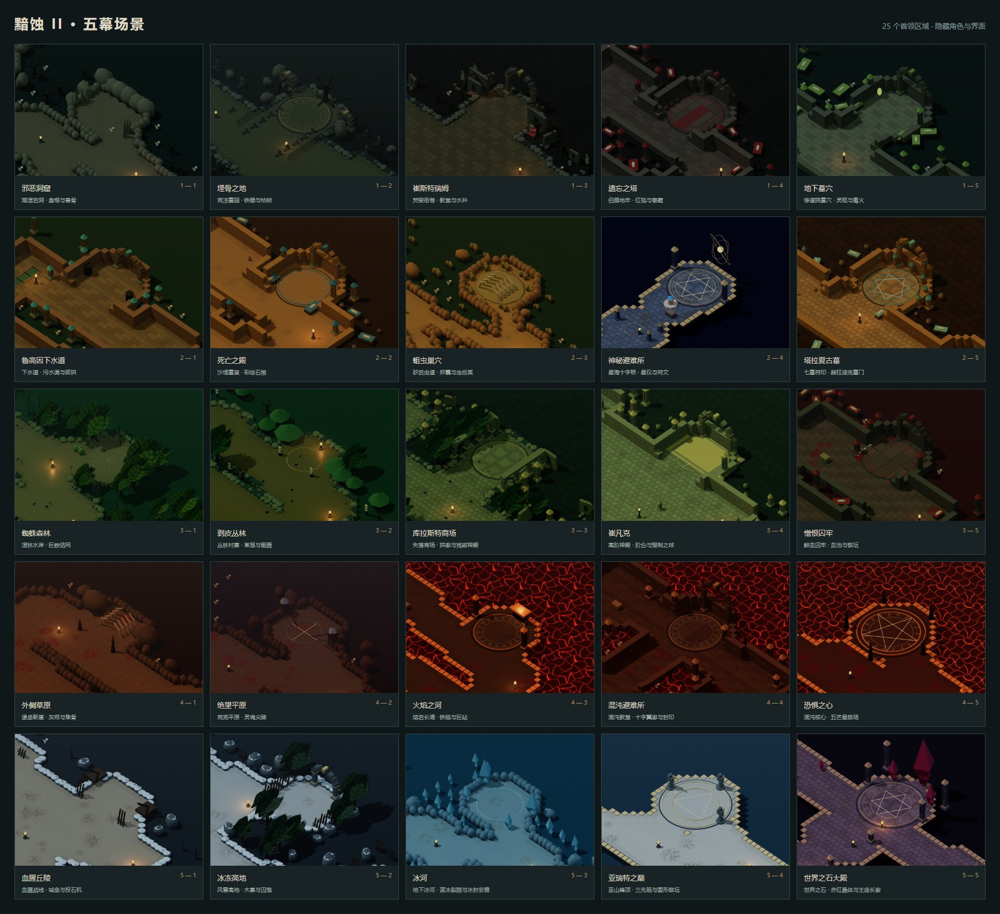

# 五幕场景与 25 关布局

25 关现在分别配置布局、地面材质、建筑与植被、首领区域地标、光照、雾气和天气。关卡沿用原有 ID、任务目标编号、出生点和存档进度；进入关卡时使用新地图，普通、噩梦、地狱共享场景布局。

场景参考《暗黑破坏神 II》各地的地貌、建筑语言和任务地标，以本项目的等距 3D 风格重新制作。几何、材质和贴花均由项目代码生成，游戏运行无需下载资源。它们是对原作氛围与空间特征的适配，没有复制原版贴图或逐块复刻原版地图；浮桥、台阶和高地保持在当前平面战斗与导航规则内。

## 逐关设计

| 章节 | 关卡 | 布局和视觉标识 |
| --- | --- | --- |
| I · 坎杜拉斯 | 邪恶洞窟 | 不规则椭圆洞室、曲折岩道、钟乳石、盘根、兽骨和潮湿地面 |
| I | 埋骨之地 | 分区墓园、成排墓碑、铁栅栏、枯树、墓室入口和阴雨 |
| I | 崔斯特瑞姆 | 方形街巷、焚毁木屋、残破教堂门面、广场水井与余烬 |
| I | 遗忘之塔 | 折返地牢、窖藏瓮罐、石棺、红色地毯与伯爵祭场 |
| I | 地下墓穴 | 修道院翼廊、高低剖切墙、灵柩、柱廊和幽绿毒火 |
| II · 鲁高因 | 下水道 | 正交砖道、低拱、污水沟、可通行栅桥和朽骨 |
| II | 死亡之殿 | 大型砂岩墓室、石棺、陶罐和彩色石柱边饰 |
| II | 蛆虫巢穴 | 更窄的曲折虫道、圆形孵化洞室、卵囊、骨架和虫后巢 |
| II | 神秘避难所 | 中央十字枢纽、四向星空浮桥、支路平台、符印和悬浮星仪 |
| II | 塔拉夏古墓 | 八角墓室、七座符印尖碑、赫拉迪克墓门和青金色镶饰 |
| III · 库拉斯特 | 蜘蛛森林 | 湿地曲径、低矮河岸、茂密蕨叶树冠、蛛网和卵囊 |
| III | 剥皮丛林 | 林间村寨、分岔泥路、草屋、骷髅图腾和火堆 |
| III | 库拉斯特商场 | 开阔石铺街区、断柱拱廊、残破建筑和侵入城镇的植被 |
| III | 崔凡克 | 神殿庭院、阶台、石柱、金色边饰与议会祭场 |
| III | 憎恨囚牢 | 暗红囚牢、鲜血沟渠、墓室残骸和献祭平台 |
| IV · 地狱 | 外侧草原 | 宽阔灰烬荒地、破碎岩崖、焦骨和恶魔尖桩 |
| IV | 绝望平原 | 苍灰荒原、冷色灵魂尖碑、铁链和较浓灰雾 |
| IV | 火焰之河 | 熔岩堤道、黑色玄武岩、铁链支架和地狱巨砧 |
| IV | 混沌避难所 | 十字形主殿与东西翼廊、哥特门廊、封印及熔岩背景 |
| IV | 恐惧之心 | 扩大核心祭场、五芒星、环形铭文和五座恶魔尖桩 |
| V · 亚瑞特 | 血腥丘陵 | 斜向攻城战线、灰雪、木制拒马、车轮与投石臂 |
| V | 冰冻高地 | 雪地寨道、木桩围栏、囚笼支路和山地植被 |
| V | 冰河 | 曲折冰道、蓝色裂纹冰面、成簇冰晶和地下冰河 |
| V | 亚瑞特之巅 | 山脊通路、云海背景、圆形祭坛与三尊先祖雕像 |
| V | 世界之石大殿 | 对称仪式长廊、两侧回廊、石柱与大型赤红世界之石 |

## 导航与性能

地面、地形边界和物理阻挡使用同一份可行走区域数据。大型装饰物添加实际碰撞，小型污迹、落叶与地面符印不阻挡移动；朝向镜头的室内墙降低高度，保证主角和地面掉落可见。所有任务目标、4～6 个箱子、补给点、首领与出口都保留通路。

地面合并为一份网格并使用连续世界坐标纹理，避免旧版逐格方砖造成的接缝。建筑与装饰按材质和阴影属性合批；贴花不会产生方形阴影。场景只保留少量局部火光，雨、雪、灰烬与星尘共用一个粒子系统。水面与熔岩通过移动纹理产生流动效果，更新过程不反复创建材质。

旧的场景销毁逻辑继续释放网格、纹理、实例缓冲和阴影资源；程序生成的纹理也随所在关卡释放。

## 开发入口与验证

| 文件 | 用途 |
| --- | --- |
| `src/scene-design.ts` | 25 关的配色、材质、地标、天气与照明 |
| `src/level-layouts.ts` | 独立布局、四向桥/十字殿/对称长廊等连接图，以及统一地形掩码 |
| `src/scenery-textures.ts` | 地表、砖石、树皮、水面、熔岩、植被与蛛网纹理 |
| `src/level-scenery.ts` | 地形、碰撞、装饰和逐关地标的构建 |
| `src/world.ts` | 场景灯光、批处理、天气更新与生命周期 |

`node --experimental-strip-types --test --test-concurrency=1 tests/scenery.test.ts tests/world-lifecycle.test.ts` 检查全部布局连接、目标位置、场景配置与合批阴影。

启动开发服务器后，运行 `npm run test:scenery`（默认 `http://127.0.0.1:5173`，可用 `BASE_URL` 指定地址），逐关渲染 25 个首领场景和代表性的手机视图，检查物理导航、地面可见性、绘制调用及资源数量，并生成总览图。`OUTPUT_DIR` 可指定截图与结果的输出位置。现有 `tests/maps-chests-browser.mjs` 继续验证真实游戏中的地图切换、寻路开箱、F 交互和触屏操作。

## 原作参考

地名与关键任务空间参考暴雪 The Arreat Summit 的 [第一幕](https://classic.battle.net/diablo2exp/quests/act1.shtml)、[第二幕](https://classic.battle.net/diablo2exp/quests/act2.shtml)、[第三幕](https://classic.battle.net/diablo2exp/quests/act3.shtml)、[第四幕](https://classic.battle.net/diablo2exp/quests/act4.shtml)及[第五幕](https://classic.battle.net/diablo2exp/quests/act5.shtml)任务说明。原作存在多层地下城、随机拼接和更复杂的高度变化，本次保留项目五章各五关的战役结构。
