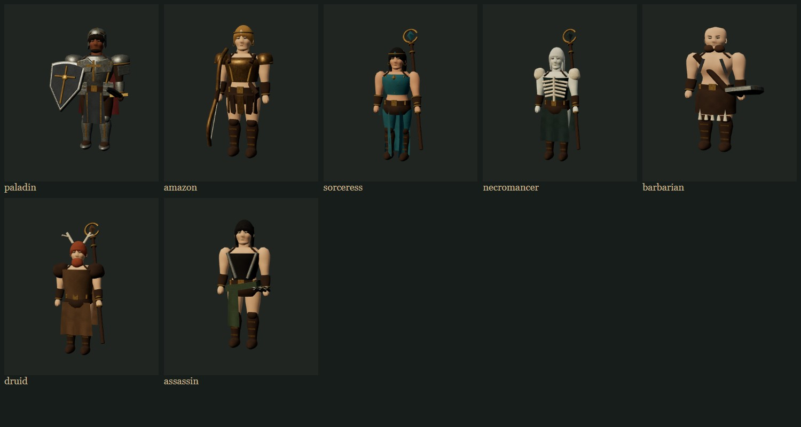
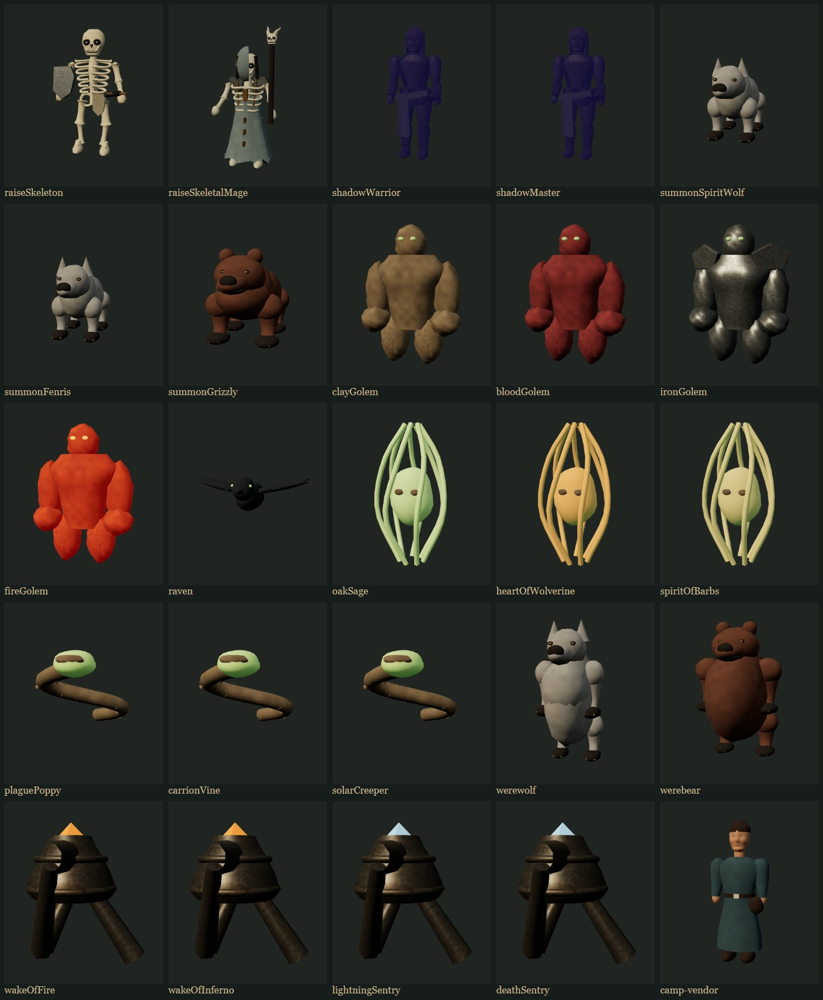

# 连续曲面建模与加载成本

本轮在 `feat/refined-models-loading` 上继续改善程序化模型。人物、怪物及召唤物共用的分段轮廓改成有界三次插值曲面，保留腰、腕、踝的收分；高密度仅用于面部、胸腹等需要表达形体的部位，小部件保留较低径向分段。

人物头脸使用连续下颌、颧骨、眼窝和鼻梁表面，补充眼白、瞳孔、眼睑及耳廓；野蛮人和石魔胸腹减少独立球体拼接。营地商人替换圆柱身体和球形头部，加入袍服、腰带、帽子与五官。部分石质道具增加共享倒角几何，导航和碰撞边界不变。

这些变化改善了轮廓与表面连续性，但仍是项目自有的程序化资产，尚不具备《暗黑破坏神 II：重制版》手工雕刻、贴图和蒙皮动画的精度，也不意味着每个怪物变种都已独立重制。

## 性能设计

- CPU 几何模板按 LRU 缓存，最多 256 项、12 MiB 属性及索引数据。模板不进入渲染器；每次返回独立缓冲区，角色形变和释放不影响其他模型。
- 有机曲面、插值轮廓、雕刻表面和挤出护甲共用缓存；护甲焊接具有相同位置、法线和 UV 的顶点，保留硬边。
- 延续关节内网格合并、怪物批量渲染和场景实例化；避免为静态 NPC 构造隐藏武器库或动画状态。
- 修复自动画质在持续出现 100–250 ms 慢帧时反复清空统计、无法降档的问题；单次慢帧仍不足以触发降档，更长的加载或暂停仍重置采样窗口。
- 相同 65 个怪物定义的目录统计：三角面从 659,324 增至 780,004（约 18%），顶点从 535,299 增至 572,740（约 7%）。这是视觉细化的成本，不能声称所有场景都因此更快。

## 验证

- 最终单元测试 611 项通过，包含新增模板缓存隔离、LRU 淘汰、容量限制、轮廓边界、几何确定性、接缝法线与连续慢帧自适应检查。
- 构建通过，保留既有的大分包提示。
- 65 个怪物定义 / 28 种体型的正反面、战斗姿态、移动端及 GPU 释放检查通过。
- 32 个职业、召唤物、变身、陷阱和营地商人的正反面、渲染预算及逐模型 GPU 释放检查通过。
- 112 组直接渲染与批量渲染的姿态、阴影、受击、尸体与隐藏状态对照通过。
- 25 张场景的导航、移动端与资源预算检查通过。
- 25 张地图的路线、宝箱交互、返营和移动端触控通过；首次运行被 Vite 错误遮罩阻挡，重新打开页面未复现，完整重跑通过。
- 场景加 40 只怪物重复加载三轮，销毁后 GPU 几何与纹理均归零；该次运行创建耗时分别为 477、187、135 ms。冷暖差异包含 JIT 和已有场景缓存作用，不全归因于新增几何缓存。

## 集显实战采样与限制

同一台 Intel UHD 770、1920×1080、31 个敌人中 24 个活跃、法师持续施法的固定种子压力场景：

| 状态 | 预热 / 采样帧数 | 平均 FPS | P95 帧间隔 | 渲染比例 |
| --- | --- | --- | --- | --- |
| 细化模型，原自适应逻辑 | 300 / 240 | 23.08 | 100.1 ms | 1.00 |
| 修复自适应逻辑 | 300 / 240 | 52.17 | 33.4 ms | 0.522 |
| 修复后较长预热 | 600 / 300 | 59.80 | 16.8 ms | 0.522 |

最后一轮通过 `PERF_ASSERT=1` 的 FPS ≥59、P95 <18 ms 检查。300 帧预热的检查未通过，说明冷启动和画质切换后的早期卡顿仍存在。更长预热的结果仅代表稳定阶段，不能与第一行做纯模型优化前后对比；自适应通过降低内部渲染分辨率及现有阴影/后处理档位换取速度，并非全画质稳定 60 FPS。原始采样保存在 [性能数据](sculpted-models-performance.json)。
