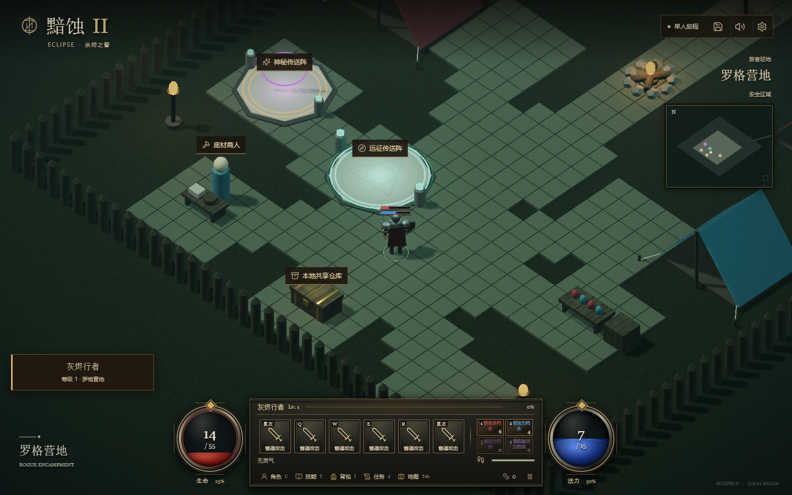
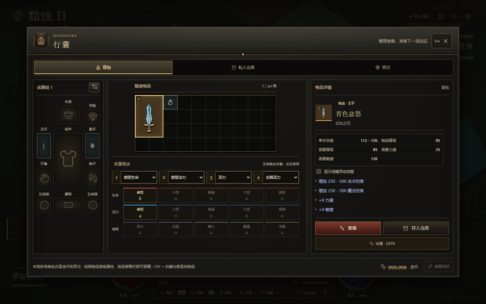
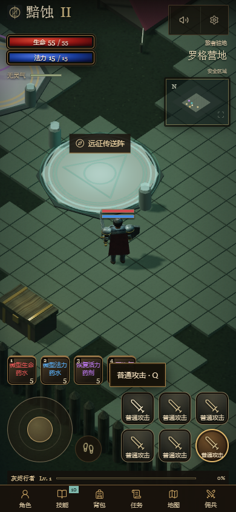
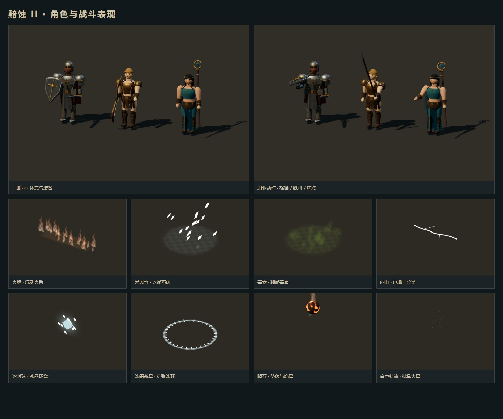

# UI 与特效细化

本轮参考[暴雪的重制版美术与可读性说明](https://news.blizzard.com/en-us/article/23695734/technical-alpha-learnings)，强化红蓝资源球、石质/铁质框架、浅色闪电电芯和冰霜层次。保留项目现有中文界面、快捷键、仓库容量和触控布局，并非原作 UI 资产移植。

## UI

- 共用面板、标题栏、HUD、背包与技能槽使用更深的石质底色和暗金属边缘；装备属性保留独立的蓝色文本层级。
- 技能槽按实际绑定技能的伤害类型着色；冷却数字、法力不足和激活光环仍有各自状态。
- 生命/法力球增加低值轮廓、`meter` 可访问读数，法力读数与画面同样向下取整。Boss 条也提供当前/最大生命信息。
- 血球、蓝球、经验、耐力和 Boss 条改为 transform 更新，不再每次变化触发布局尺寸动画。资源比例按千分之一取整，数值文本仍独立更新。
- 去掉弹窗的全屏背景模糊、资源球常驻波动和按钮阴影动画；保留减少动态效果、键盘焦点与触控响应。

## 特效与开销

- 闪电使用更白、更厚的电芯，将外层、电芯、分叉合为一个带顶点颜色的网格：单条分叉闪电从 3 次绘制变为 1 次。
- 火焰增加流动火舌与亮芯；冰霜粒子有生成/消散过渡；毒雾保持较低透明度，地面法术增加柔和轮廓。
- 冰霜新星使用柔边波纹；陨石增加焦壳与发亮熔隙。
- 火焰、冰片和毒雾的位置运动在顶点着色器计算。实例矩阵只在创建时上传，每帧只更新材质时间/渐隐参数；每片地面法术仍限制最多 32 个粒子。
- 地面透明材质启用单次双面绘制，不增加纹理贴图或动态灯光。

## 回归与可复现检查

- `npm test`：608 项通过。
- `npm run build`：通过，保留既有大分包提醒。
- `npm run test:visuals`：特效着色器、动画差异、手机视图、资源释放稳定性通过。
- `tests/visual-effects.test.ts` 验证粒子动画不重写实例缓冲区，以及闪电合并后端点、颜色和资源释放；弹道池回归通过。
- `node tests/hud-rendering-browser.mjs`：生命/法力读数和低生命状态通过；资源不变时连续 60 次更新的资源条样式写入数为 0。
- UI 布局与交互：126 个主要面板布局、40 个角色管理/图鉴/死亡界面布局，物品操作、技能绑定、状态提示与仓库详情通过；键盘焦点、模态导航和减少动态效果通过。
- 手机回归：8 种尺寸、80 个面板、资源比例、双指移动/攻击、旋转/模态释放通过，并验证手机专属样式不影响桌面。

UI 测试用 `BASE_URL=http://127.0.0.1:5173/?mode=local`；`test:mobile-ui` 自行追加本地模式，使用不带查询参数的地址。HUD 专项不传 BASE_URL 时默认本地模式。

测试中修正了可访问性脚本中过时的“初始生命/法力”文案断言，与当前“职业基础生命/法力”一致。并行执行期间一次手机佣兵面板等待超时，独立重跑完整手机回归通过。

## 性能采样与边界

[原始性能数据](ui-effects-performance.json)包含短预热和长预热的前后样本。本机 Intel UHD 770，1920×1080，自动画质；固定地图种子 20260913，法师密集施法、24 个活跃敌人。长预热为 300 帧，正式采样 240 帧，两个版本顺序运行，均累计 24 次施法。

| 长预热样本 | 修改前 | 修改后 |
|---|---:|---:|
| 平均 FPS | 60.00 | 60.00 |
| P95 帧间隔 | 16.8 ms | 16.8 ms |
| UI 平均耗时 | 1.64 ms | 1.55 ms |
| 渲染平均耗时 | 6.21 ms | 6.09 ms |
| 自动像素比例 | 0.522 | 0.522 |

该样本说明在相同自动降分辨率下未出现持续帧率退化，不代表原生 1080p 或所有场景稳定 60 FPS，也不把微小耗时差异解释为普遍提升。短预热样本仍出现约 1.85–1.95 秒长帧，修改前后平均约 25 / 23 FPS；首次着色器编译及加载卡顿仍需另行处理。本次确定减少的是资源条重复样式写入、粒子实例矩阵上传与单条闪电的绘制次数。
