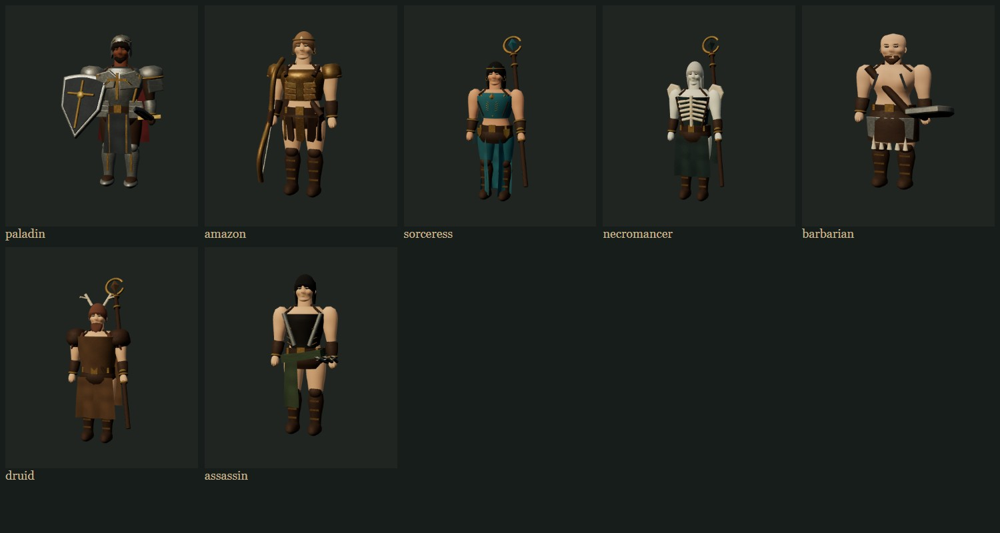
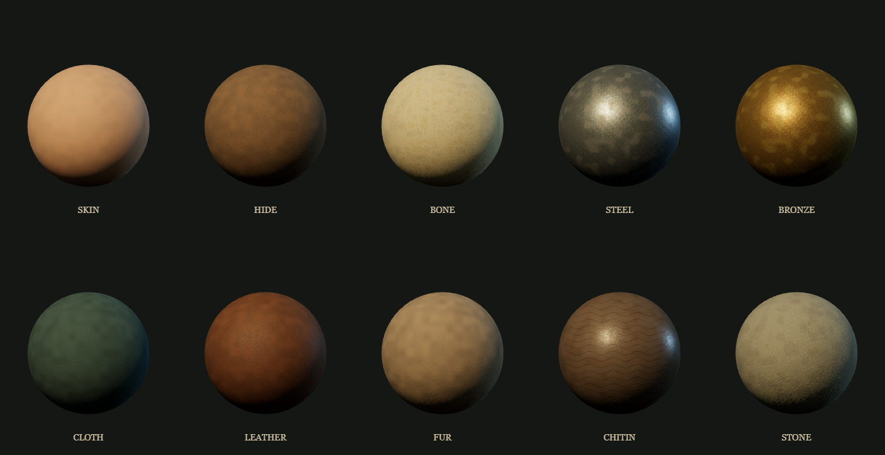
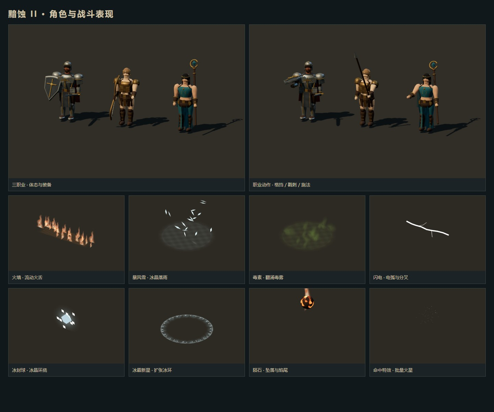
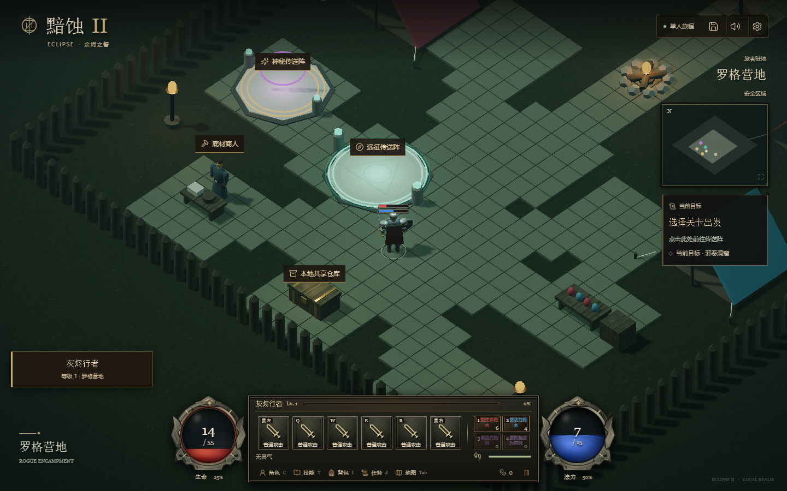

# 模型、表面质感与视觉表现细化

这一轮以《暗黑破坏神 II：重制版》的写实比例、旧装备、阴郁色调和清晰职业轮廓为方向，覆盖七职业、65 个怪物定义共用的 28 种体型，以及召唤物、变身、营地人物、场景材质、特效和共用 UI。特效的白色闪电核心、冰霜层次与界面可读性参考[暴雪的重制版美术说明](https://news.blizzard.com/en-us/article/23695734/technical-alpha-learnings)。

当前资产仍是原创程序化网格与着色器表面；原作级高模烘焙、皮肤次表面散射和逐资产制作的贴图，仍有进一步提升空间。下面的图片均为本项目实际渲染。

## 模型与材质

- 人物缩小头部比例，强化眉弓、眼窝、颧骨、下颌、锁骨与背部肩胛；胡须改用贴合下颌的渐尖曲面。
- 七职业分别细化盾甲纹饰、亚马逊胸甲叠片、法师织物扣饰、死灵骨质肩甲、野蛮人裙甲、德鲁伊毛皮锁束、刺客皮甲扣带。职业辨识仍主要依靠轮廓、装备与服饰。
- 骷髅增加有棱角的眼眶、眉骨和颌骨；牛怪改用较长的口鼻、硬质耳廓与贴合胸部的不规则皮斑；狼熊口鼻收窄，傀儡头部加强岩块形体。
- 小型有机体块减少纬向细分；骨点、脸部和装备的曲面保留独立预算。静态细节仍在关节内合并，保留肘、膝、手持装备和布料的动画结构。

所有 `actorMaterial` 使用者按十类表面区别颜色、微起伏、粗糙度和金属响应；覆盖角色、怪物、同伴、陷阱及对应场景饰物。

| 表面 | 质感处理 |
|---|---|
| 皮肤 | 低对比肤色变化、轻微孔隙、较柔和的高光 |
| 兽皮 | 不规则细折痕、孔隙、局部磨损 |
| 骨骼 | 暖灰骨色、孔隙与陈旧沉积 |
| 钢铁 | 冷色反射、细划痕和较粗糙的氧化区域 |
| 黄铜 | 暖金属基色、少量偏绿的氧化变化 |
| 布料 | 织纹、色差与高粗糙度 |
| 皮革 | 棕色层次、细折痕和局部抛光感 |
| 毛发 | 沿毛束方向的细纹，避免水平条带感 |
| 甲壳 | 硬质高光、增长纹和冷暖变化 |
| 石材 | 矿物颗粒、细裂隙与较平缓的反射 |

高频细节按屏幕投影尺寸衰减，织纹和毛发采用更严格的过滤，减少远距离和自动降分辨率时的闪烁。表面噪声使用不含正弦运算的散列；角色材质没有新增 GPU 纹理。颜色、粗糙度和微法线采用同一套表面信息，金属氧化区域也相应降低金属反射。

[怪物目录预览](visual-refinement-monsters.jpg) · [首领目录预览](visual-refinement-bosses.jpg)。场景石砖增加缺角、矿物划痕和沉积，全部烘入现有缓存画布；场景中的铜饰、铁件、骨骸和布料使用对应表面材质。建筑铜饰保留较强漫反射，确保深渊背景前的桥边仍可辨认。

## 特效与 UI

- 火焰增加不规则流动火舌、亮芯与消散边缘，毒雾使用较低亮度的翻卷团块。
- 冰片改为长晶体，增加明暗晶面与随机尺寸，并沿地面法线落下；冰霜新星采用较宽的柔边、窄亮边和不等长碎晶。
- 闪电加粗白色核心，并细化弯折分叉；外层、核心和分叉仍在一个网格内绘制。
- 地面效果仍最多 32 个实例，位置缓冲只在创建时上传；不增加动态光源。
- 共用 UI 增加石质底纹、旧金属边缘、技能槽凹刻与原创资源球装饰；物品图标调整为更克制的钢铁、皮革色调。
- 修复触屏横屏下符文页误用背包双列布局的问题，符文名字和编号不再被挤入零宽网格。

[装备面板](visual-refinement-inventory.png) · [手机 HUD](visual-refinement-mobile.png)

## 几何与性能

几何统计使用修改前提交 `9677513` 的源码归档与修改后源码，在同一脚本中构造全部模型。统计包含模型内保留的网格，职业还包含互斥显示的装备；它不是实际每帧绘制次数。

| 目录 | 修改前总三角形 | 修改后总三角形 | 变化 |
|---|---:|---:|---:|
| 65 个怪物定义 | 779,804 | 693,300 | −11.1% |
| 七职业 | 200,284 | 182,904 | −8.7% |

怪物网格总数保持 1,586；职业网格总数由 613 增至 618。相同怪物目录的几何缓冲由 22,703,440 字节降至 21,165,536 字节。[逐模型原始统计](visual-refinement-geometry.json)。

实测设备为 Intel UHD Graphics 770，1920×1080、DPR 1、自动画质，前后像素比例均为 0.522。法师、24 个活跃敌人、密集法术和 40 份掉落；地图种子相同，预热 600 帧、采样 300 帧。性能采样独立于构建和其他浏览器回归执行。

| 场景 | FPS 前 → 后 | P95 帧间隔前 → 后 | 每帧平均渲染提交耗时前 → 后 |
|---|---:|---:|---:|
| 火焰之河 | 55.0 → 59.4 | 33.3 → 16.8 ms | 8.14 → 6.12 ms |
| 牛关 | 49.7 → 60.0 | 33.4 → 16.8 ms | 9.25 → 6.20 ms |

[前后性能原始数据](visual-refinement-performance.json)。渲染耗时是浏览器主线程提交时间，未使用 GPU 计时器。法术按经过时间推进，帧数相同但耗时不同，使累计施法次数分别为 44 → 36、37 → 33；这些样本可以检查本机是否出现持续性能退化，不能将全部差异归因于单项视觉改动，也不代表原生 1080p 或所有设备都能稳定 60 FPS。

## 验证

- `npm test`：616 项通过。`npm run build` 通过，仍有既有的大分包提醒。
- `npm run test:materials`：十类材质在原生与降低分辨率下编译和渲染；10 次绘制、0 个纹理，释放后几何和纹理均为 0。
- 模型目录：65 个怪物定义、32 个职业／同伴／变身／陷阱／NPC 用例；正反面、动作、手机取景和资源释放通过。
- `test:monster-batches`：112 组模型／姿态，合批画面与直接渲染一致，含阴影、受击、尸体和隐藏状态。
- `test:visuals`、`test:model-loading`：特效变化、粒子预算、几何缓存隔离、重复加载和 GPU 释放通过。
- `test:maps`、`test:scenery`：25 个场景，任务、首领、出口、补给和宝箱可达；场景可读性、绘制和资源预算通过。
- `test:ui`：126 个主面板布局和 40 个角色管理等布局，以及交互、可访问性、装备详情通过。
- `test:item-art`：499 个底材图标保持不同像素、无裁切；四种尺寸的背包、符文、镶嵌与百科通过，包含触屏横屏。
- `test:mobile-ui`：8 种手机尺寸、80 个面板、触控目标、药水与技能、双指移动／攻击和旋转释放通过；四种桌面尺寸的计算样式不受手机规则影响。
- HUD 专项：低生命轮廓、资源读数正确，资源不变的 60 次更新产生 0 次样式写入。

回归中发现的神秘避难所亮度不足和横屏符文文字挤压均已修复并重测。新增材质展示测试最初混用了浏览器中的两份 Three 模块，造成测试网格未释放；已改由测试夹具直接释放其自有资源。生产模型的释放由模型目录和重复加载回归验证。

并行运行手机回归时，一次佣兵面板的触控打开检查在 5 秒后超时；独立重跑完整 `test:mobile-ui` 通过。该间歇性等待问题保留在此记录，不将并行失败的那次执行计为通过。

复现材质、模型、场景检查时，`BASE_URL` 使用 `http://127.0.0.1:5173`；应用 UI、地图、物品和性能检查使用 `http://127.0.0.1:5173/?mode=local`。`test:mobile-ui` 自行追加本地模式。所有支持的脚本可用 `OUTPUT_DIR` 指定独立产物目录。
